**Build documented:** branch `MSK-CL`, commit `ccfed28`, captured 27 Aug 2026
**Demo boutique used throughout:** Kanchi Threads (Chennai)
**Every screenshot in this guide** was taken from the running application by
[`capture.py`](capture.py). Re-run that script against a later build to
re-verify the guide.

---


| # | Section |
|---|---------|
| 1 | [Introduction](#1-introduction) |
| 2 | [Getting started](#2-getting-started) |
| 3 | [Roles and permissions](#3-roles-and-permissions) |
| 4 | [The public website](#4-the-public-website) |
| 5 | [Authentication](#5-authentication) |
| 6 | [Boutique owner guide](#6-boutique-owner-guide) |
| 7 | [Design management](#7-design-management) |
| 8 | [Designer guide](#8-designer-guide) |
| 9 | [Order management](#9-order-management) |
| 10 | [Multi-garment orders](#10-multi-garment-orders) |
| 11 | [Measurements](#11-measurements) |
| 12 | [Inventory management](#12-inventory-management) |
| 13 | [Master guide](#13-master-guide) |
| 14 | [Tailor guide](#14-tailor-guide) |
| 15 | [Production workflow](#15-production-workflow) |
| 16 | [Payment management](#16-payment-management) |
| 17 | [Invoices](#17-invoices) |
| 18 | [Customer communication](#18-customer-communication) |
| 19 | [Customer order tracking](#19-customer-order-tracking) |
| 20 | [Try-On](#20-try-on) |
| 21 | [Notifications and alerts](#21-notifications-and-alerts) |
| 22 | [Search, filters and sorting](#22-search-filters-and-sorting) |
| 23 | [Reports and analytics](#23-reports-and-analytics) |
| 24 | [Settings and profile](#24-settings-and-profile) |
| 25 | [Mobile experience](#25-mobile-experience) |
| 26 | [Super Admin console](#26-super-admin-console) |
| 27 | [Appointments](#27-appointments) |
| 28 | [Troubleshooting](#28-troubleshooting) |
| 29 | [FAQ](#29-faq) |
| 30 | [Glossary](#30-glossary) |
| 31 | [Known gaps / not yet implemented](#31-known-gaps--not-yet-implemented) |
| 32 | [Final product workflow](#32-final-product-workflow) |

Companion documents: **[Demo Guide](demo-guide.md)** · **[Product Coverage Matrix](coverage-matrix.md)**

---


Order-management and CRM software for businesses that cut and stitch every
garment to one client's measurements — bridal boutiques, saree houses, blouse
specialists, designer ateliers.

It replaces the notebook, the WhatsApp thread and the whiteboard with one
record per order that the owner, the master tailor, the stitching tailor, the
designer and the customer all read from.


| Problem | What the product does |
|---|---|
| Measurements live in a notebook | Per-garment measurement sets stored against the customer, versioned |
| "Which tailor has this order?" | Every order names a supervising Master and a stitching Tailor |
| "Where is my garment?" | 15 production stages, each timestamped, visible to staff and the customer |
| "How much fabric is left?" | Stock ledger; every movement recorded, reservations against orders |
| "Has this client paid?" | Advance / balance / paid, per order, with an invoice |
| "Any update?" (customer, daily) | A public tracking link and pre-composed WhatsApp updates |


Owner · Master Tailor · Stitching Tailor · seven production specialists ·
Designer · End customer (no login) · Platform Super Admin.


```text
Boutique signs up  →  own isolated database schema created
        ↓
Staff added (Masters, Tailors, Designers)  →  each gets a login
        ↓
Fabrics + inventory stocked
        ↓
Customer created  →  Order created (1..n garments)
        ↓
Per garment: measurements · design · fabric · materials · price
        ↓
Master + Tailor assigned   →  Advance payment recorded
        ↓
15 production stages, each owned by a role
        ↓
Finished-garment photos published  →  Balance paid  →  Delivered
        ↓
Customer follows the whole thing on a public tracking link
```

Multi-tenancy is real: each boutique's data lives in its own PostgreSQL schema.
Two boutiques on the same server cannot see each other's customers, prices or
patterns.

---


| Item | Requirement |
|---|---|
| Browser | Any current Chrome, Edge, Safari or Firefox. The workspace is a React SPA. |
| Screen | Works from 390 px (phone) upward — see [§25](#25-mobile-experience) |
| Network | Always-online. There is no offline mode. |
| Account | One boutique account per business; staff logins are issued by the owner |


| Surface | Path |
|---|---|
| Public website | `/` |
| Boutique workspace | `/app.html` |
| Platform console | `/superadmin.html` |
| Customer order tracking | `/track/<token>/` — served by Django, no sign-in |


**Figure 1 — The public site**

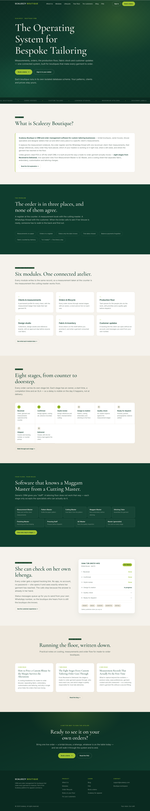

**Figure 2 — Sign in**

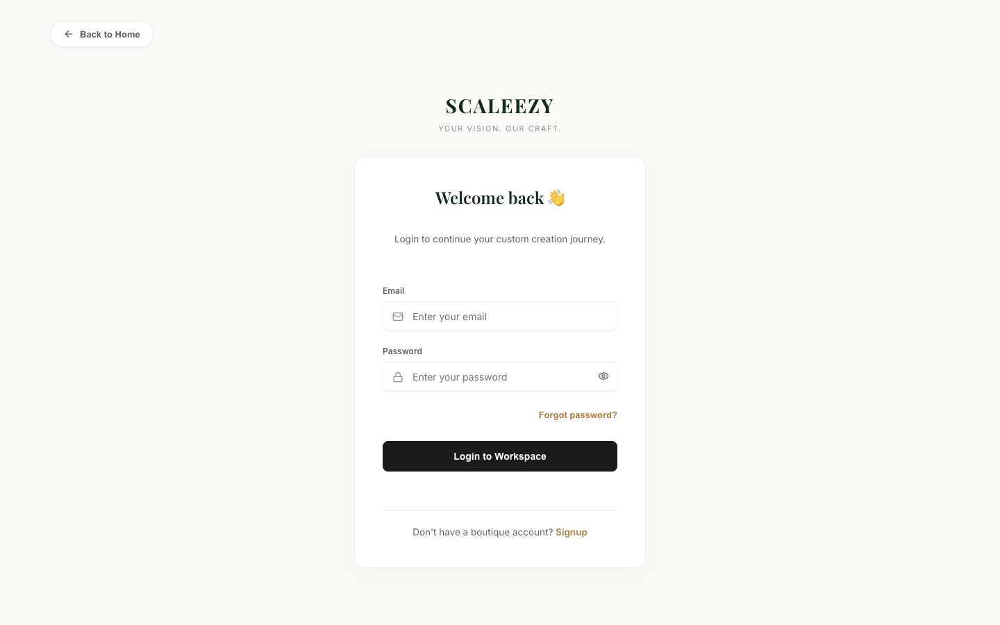

Click **Signup** at the bottom of the sign-in card.

**Figure 3 — Signup step 1, your account**

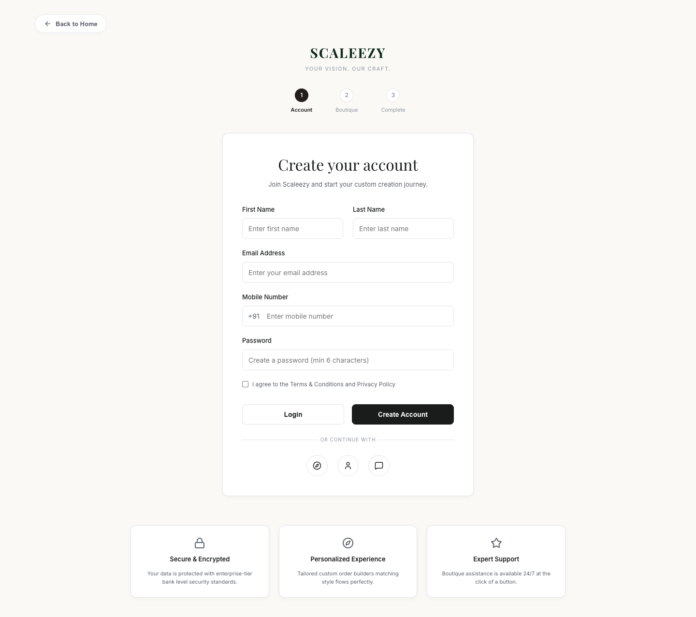

1. First name, last name.
2. Email address — this becomes the owner's login and identifies the boutique.
3. Mobile number (+91 fixed prefix).
4. Password, minimum 6 characters.
5. Tick **I agree to the Terms & Conditions and Privacy Policy**.
6. **Create Account** — this only advances the wizard. Nothing is saved yet.

**Figure 4 — Signup step 2, your boutique**

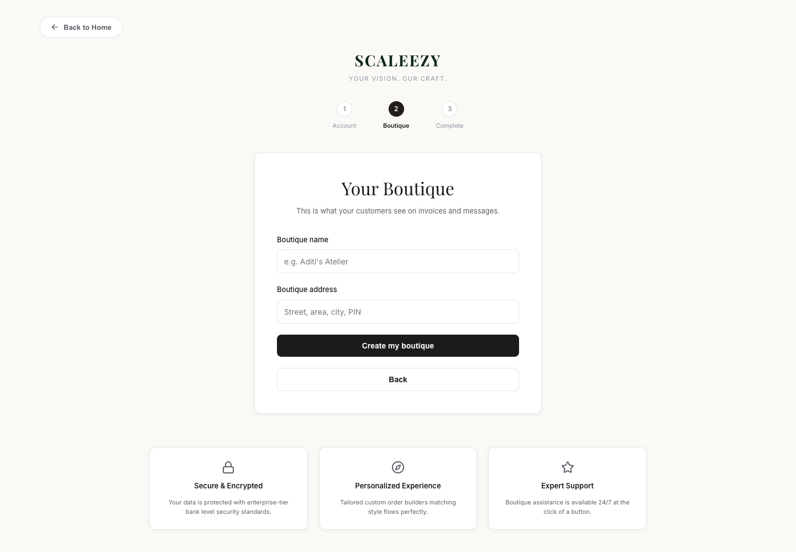

Boutique name and address. Both appear on invoices and on the customer's
tracking page, so enter the real trading name and the address a customer would
collect from.

Press **Create my boutique**. This is the step that does the work: it creates
the boutique's database schema, runs its migrations, seeds default data and
signs you in. **It takes 20–45 seconds.** The button reads *Creating your
boutique…* throughout — do not reload the page.

**Figure 5 — Registration complete**

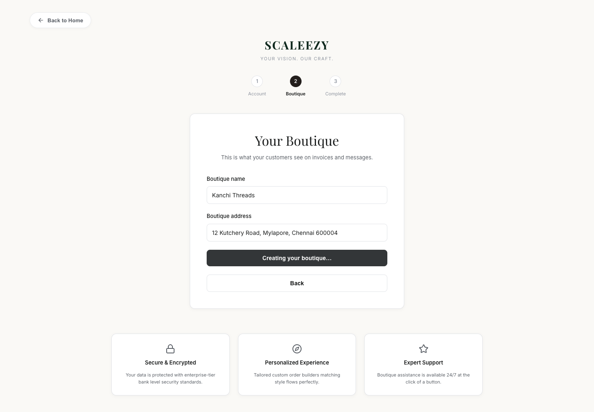

You land on the owner dashboard.


Do these before taking a real order, in this sequence:

1. **My Account** → boutique name, address, phone, email, logo (they print on
   invoices and the customer tracking page).
2. **Manage Tailors** → add your Masters and Stitching Tailors.
3. **Manage Designs** → add Designers, then designs.
4. **Manage Fabrics** → your fabric library.
5. **Inventory** → items and opening stock.

---


| Role | How it is created | What it is for |
|---|---|---|
| **Owner** | Signup | The business. Full access. |
| **Master Tailor** | Manage Tailors, role *Master Tailor (generalist)* | Supervises the floor, runs most production stages |
| **Stitching Tailor** | Manage Tailors, role *Stitching Tailor* | Stitches; owns the stitching stages |
| **Specialists** (7) | Manage Tailors | Measurement / Pattern / Cutting / Maggam / Finishing / Pressing / QC — each owns its own stage |
| **Designer** | Manage Designs → *Add designer* → *Grant login* | Design library and assigned design work only |
| **Super Admin** | Platform-side, not from inside a boutique | Runs the platform across all boutiques |

The **end customer never signs in.** They open a signed tracking link.


| Menu item | Owner | Master | Tailor / specialist | Designer |
|---|---|---|---|---|
| Dashboard | ✅ | — | — | — |
| Manage Orders | ✅ | ✅ | — | — |
| Customers | ✅ | ✅ | — | — |
| Invoices | ✅ | — | — | — |
| Analytics | ✅ | — | — | — |
| Manage Fabrics | ✅ | — | — | — |
| Inventory | ✅ | — | — | — |
| Manage Tailors | ✅ | — | — | — |
| Manage Designs | ✅ | — | — | ✅ (as *Design Studio*) |
| Design Work | ✅ | ✅ | — | ✅ (as *My Work*) |
| My Assignments | — | ✅ | ✅ | — |
| My Account | ✅ | ✅ | ✅ | ✅ |


This is enforced on the server, not only in the menu (`core/permissions.py`):

| Capability | Owner | Master | Tailor / specialist | Designer |
|---|---|---|---|---|
| Read customers, orders, inventory | All | Orders on the floor + their customers | Only orders they are on | **No access** |
| Create / edit customers, fabrics, inventory, staff | ✅ | ❌ | ❌ | ❌ |
| Advance a production stage | ✅ | Stages their role owns | Stages their role owns | ❌ |
| Assign a stage to someone | ✅ | ✅ | ❌ | ❌ |
| Upload / publish finished-garment photos | ✅ | ✅ | ❌ | ❌ |
| Master verification checklist | ✅ | ✅ | ❌ | ❌ |
| Record payments, edit prices | ✅ | ❌ | ❌ | ❌ |
| Boutique settings | ✅ | ❌ | ❌ | ❌ |
| Design library | ✅ | Read | ❌ | ✅ |

A designer account is refused outright on customers, orders, inventory and
settings — the Design Studio has its own permission classes.

---


A plain static site, built separately from the app (`npm run build`), so it is
readable by crawlers. Pages:

| Page | Purpose | Screenshot |
|---|---|---|
| Home | Positioning, the pitch, sign-in and demo CTAs | [01](screenshots/common/01-landing-page.png) |
| What it is | Product explanation | [01b](screenshots/common/01b-site-what-it-is.png) |
| Modules | Feature areas | [01c](screenshots/common/01c-site-modules.png) |
| Lifecycle | The order lifecycle, explained for buyers | [01d](screenshots/common/01d-site-lifecycle.png) |
| For customers | What the end customer gets | [01e](screenshots/common/01e-site-for-customers.png) |
| Book a demo | Lead capture — leads land in the Super Admin console | [01f](screenshots/common/01f-site-demo-request.png) |
| FAQ | Common questions | [01g](screenshots/common/01g-site-faq.png) |

The two CTAs that matter: **Sign in to your atelier** → `/app.html`, and
**Book a demo** → the lead form.

---


1. Open `/app.html`.
2. Enter the email address and password.
3. **Login to Workspace**.
4. The server finds which boutique the account belongs to and routes you into
   that boutique's schema.
5. You land on the screen for your role — Dashboard for an owner, **My
   Assignments** for production staff, **My Work** for a designer.


**Figure 6 — Rejected sign-in**

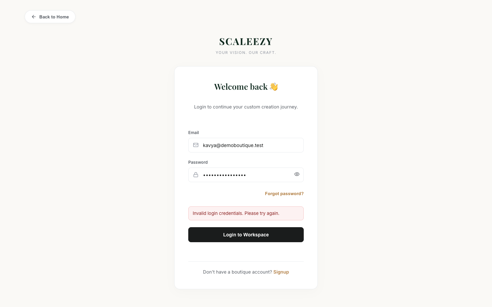

The message is exactly: *Invalid login credentials. Please try again.* It does
not say whether the email or the password was wrong — deliberate.


**Figure 7 — Reset your password**

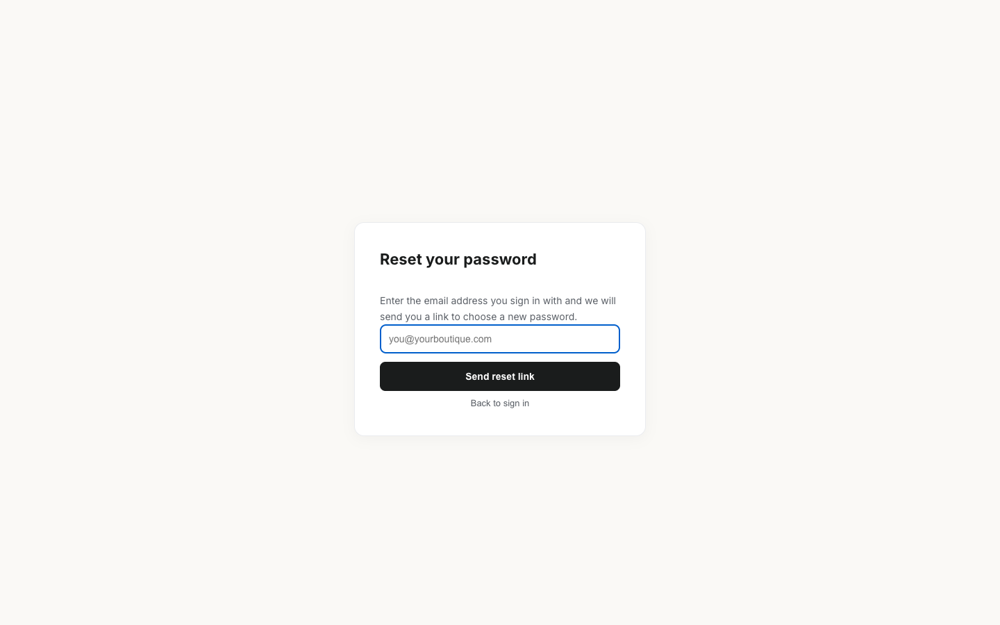

*Forgot password?* → enter the sign-in email → **Send reset link**. The reset
link is emailed, so the boutique needs SMTP configured (`EMAIL_HOST` and
friends); with no mail backend configured the request still reports success.


**Logout** is the last item in the sidebar on every screen, and inside the Menu
sheet on a phone.

---


**Figure 8 — Owner dashboard**

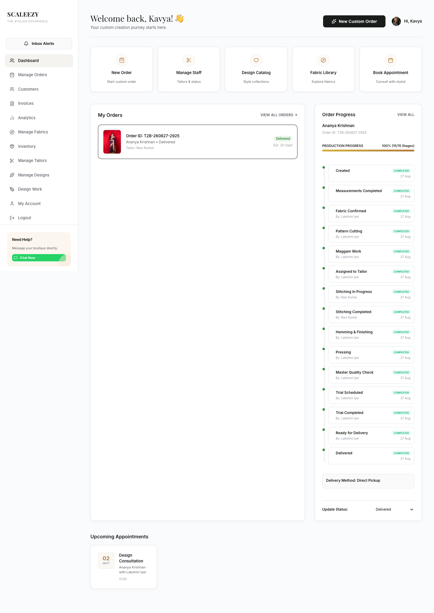

1. **Sidebar** — every module the owner can reach.
2. **Inbox Alerts** — unread notification count.
3. **New Custom Order** — the order wizard; the single most-used button.
4. **Quick tiles** — New Order, Manage Staff, Design Catalog, Fabric Library,
   Book Appointment.
5. **My Orders** — order cards with thumbnail, client, status, estimated delivery.
6. **Order Progress** — the selected order's 15 stages with who did what, when.
7. **Upcoming Appointments**.

On a brand-new boutique the same screen is empty, with the prompt *No active
custom orders. Click "New Custom Order" to begin!* —
[10-owner-dashboard-empty.png](screenshots/owner/10-owner-dashboard-empty.png).


**Figure 9 — My Account**

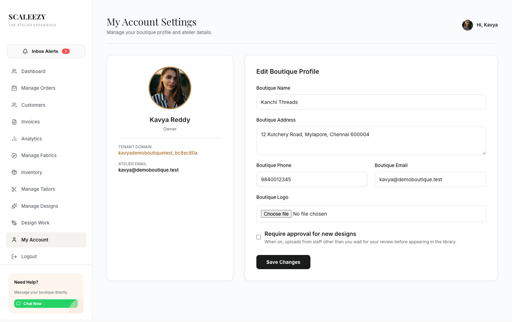

Read-only identity: your name, role, **tenant domain** (the schema name) and
atelier email.

Editable: **Boutique Name · Boutique Address · Boutique Phone · Boutique Email
· Boutique Logo**, plus one switch — **Require approval for new designs**. With
it on, uploads by anyone other than the owner wait for review before they appear
in the library.

**Save Changes** commits. These four fields print on invoices and on the public
tracking page; if you leave them blank the customer sees blanks, not placeholder
text.


**Figure 10 — Manage Tailoring Staff**

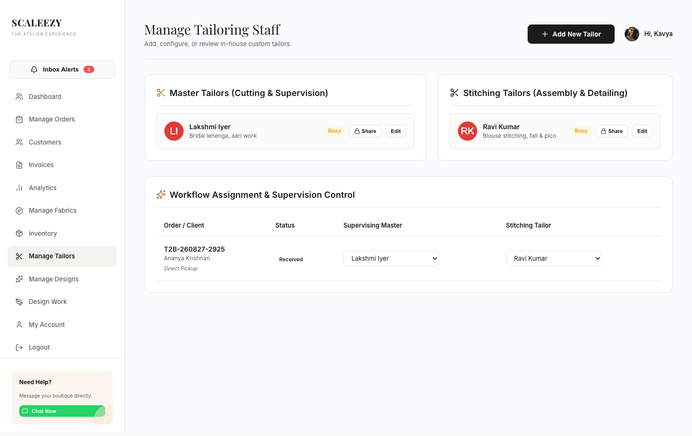

Two rosters — *Master Tailors (Cutting & Supervision)* and *Stitching Tailors
(Assembly & Detailing)* — and below them **Workflow Assignment & Supervision
Control**, a table of every order in creation with its Master and Tailor.


**Figure 11 — Add New Tailor Profile**

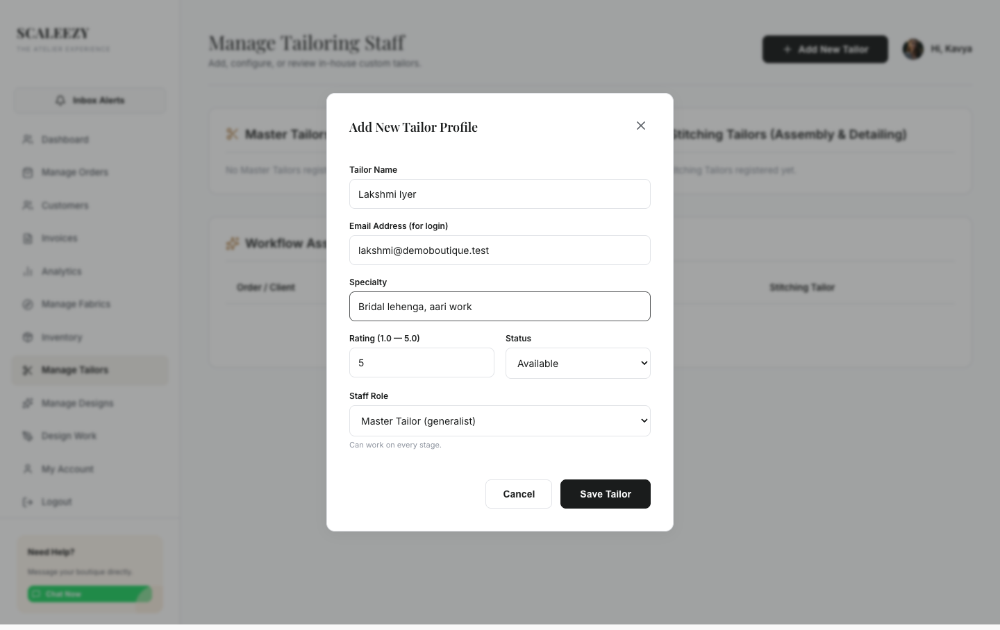

| Field | Notes |
|---|---|
| Tailor Name | Shown on orders and to the customer's staff-facing records |
| Email Address (for login) | Creates the login. Leave blank for a no-login profile. |
| Specialty | Free text, e.g. *Bridal lehenga, aari work* |
| Rating (1.0 — 5.0) | Feeds the Atelier Average Rating on Analytics |
| Status | Available / Busy |
| Staff Role | Stitching Tailor, Master Tailor (generalist), or one of Measurement / Pattern / Cutting / Maggam / Finishing / Pressing / QC Master |

**Save Tailor**.


**Figure 12 — Share Login Credentials**

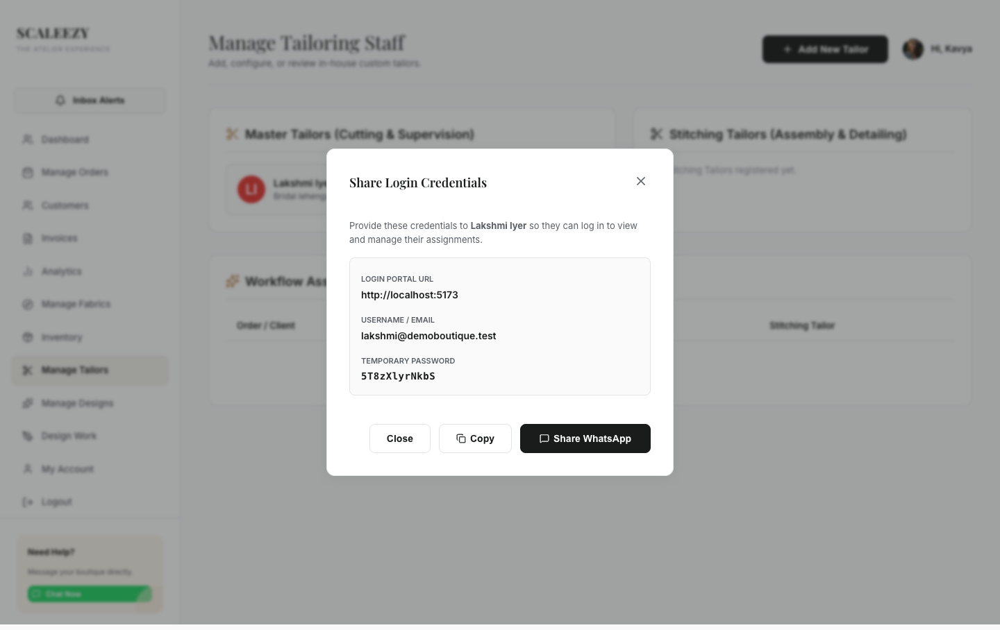

The password is generated by the server and displayed **exactly once**. It is
never recoverable afterwards. The modal offers **Copy** and **Share WhatsApp**.
Copy it before closing.

> The specialist roles (QC Master, Cutting Master, and so on) are created
> correctly and receive their stages, but the two rosters on this screen only
> render Masters and Stitching Tailors — a specialist you add will not appear in
> either list. See [§31](#31-known-gaps--not-yet-implemented).


**Figure 13 — Customer directory**

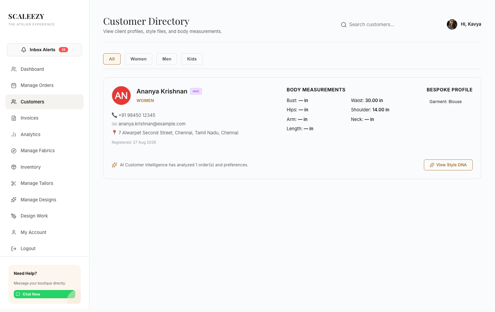

Filters: **All / Women / Men / Kids**. Search by name or mobile. On an empty
boutique the screen offers **Add your first customer**.

Customers are normally created inside the order wizard (step 1), because in a
boutique a customer and their first order arrive together.

**Figure 14 — Customer profile**

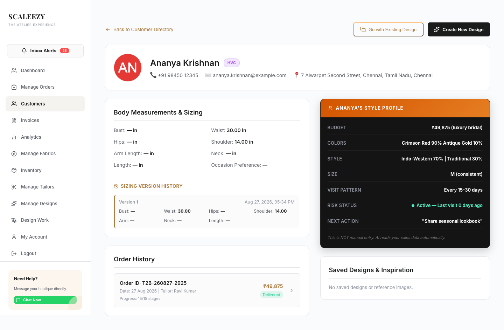

1. **Header** — name, segment badge (VIP / HVC / General), phone, email, address.
2. **Body Measurements & Sizing** — bust, waist, hips, shoulder, arm, neck,
   length, occasion preference.
3. **Sizing Version History** — every revision, dated. Measurements are never
   overwritten silently.
4. **Order History** — order id, date, assigned tailor, stage progress (e.g.
   *15/15 stages*), value, status.
5. **Style Profile** — derived from the customer's own orders: budget band,
   colour split, style split, size consistency, visit pattern, risk status and a
   suggested next action.
6. **Go with Existing Design / Create New Design** — start the next order for
   this customer.


**Figure 14a — Manage Fabric Library**

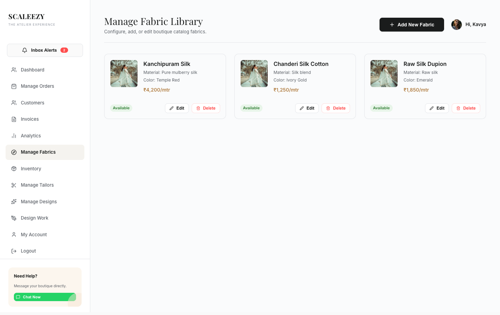

The boutique's own fabric catalogue, separate from Inventory: Inventory tracks
*quantities* of material, this screen holds the *fabrics you offer a client* in
the order wizard. Each card shows name, material, colour, price per metre,
availability, with **Edit** and **Delete**.

**Figure 14b — Add New Fabric**

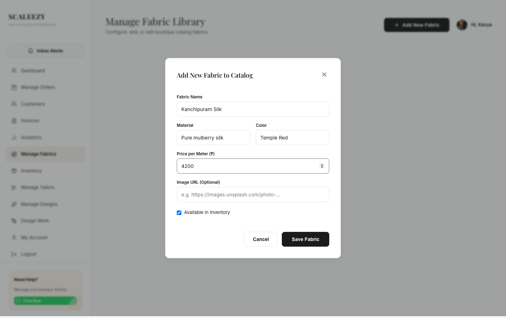

Fabric Name · Material · Color · Price per Meter (₹) · Image URL (optional) ·
**Available in Inventory** → **Save Fabric**.

---


**Figure 15 — Manage Designs, dashboard tab**

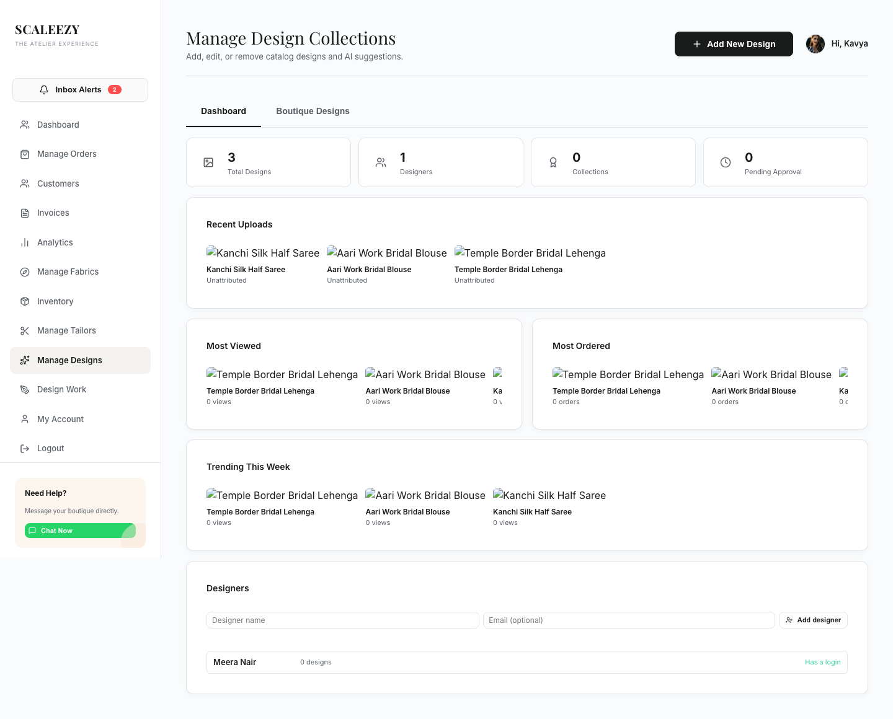

Counters: Total Designs · Designers · Collections · Pending Approval. Panels:
Recent Uploads, Most Viewed, Most Ordered, Trending This Week, and the
**Designers** roster.

**Boutique Designs** switches to the library itself, grouped by garment: Saree,
Blouse, Lehenga, Lehenga Blouse, Dupatta, Kurti, Anarkali, Petticoat, Salwar,
Churidar, Palazzo, Sharara, Gown, Suit (Kameez), Sherwani, Uncategorised.


**Figure 16 — Add designer**

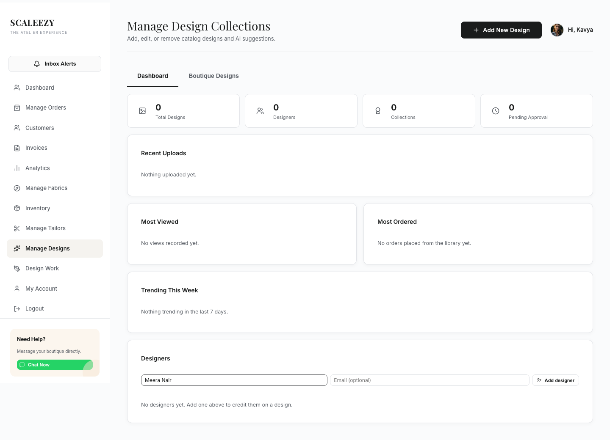

Name (required) and email (optional) → **Add designer**. Then, on the designer's
row, enter their address and press **Grant login**.

**Figure 17 — Designer login issued**

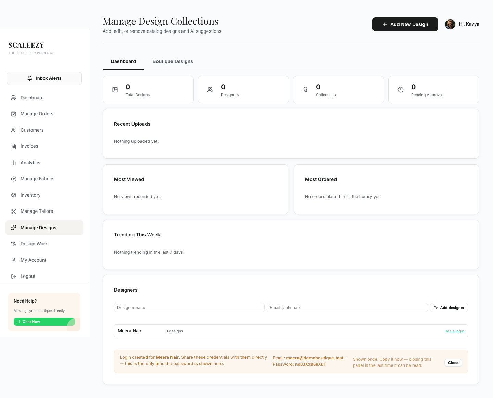

Again the password is shown once: *Shown once. Copy it now — closing this panel
is the last time it can be read.* If the person already had an account, no new
password is issued and the panel says so.


**Figure 18 — Add New Design**

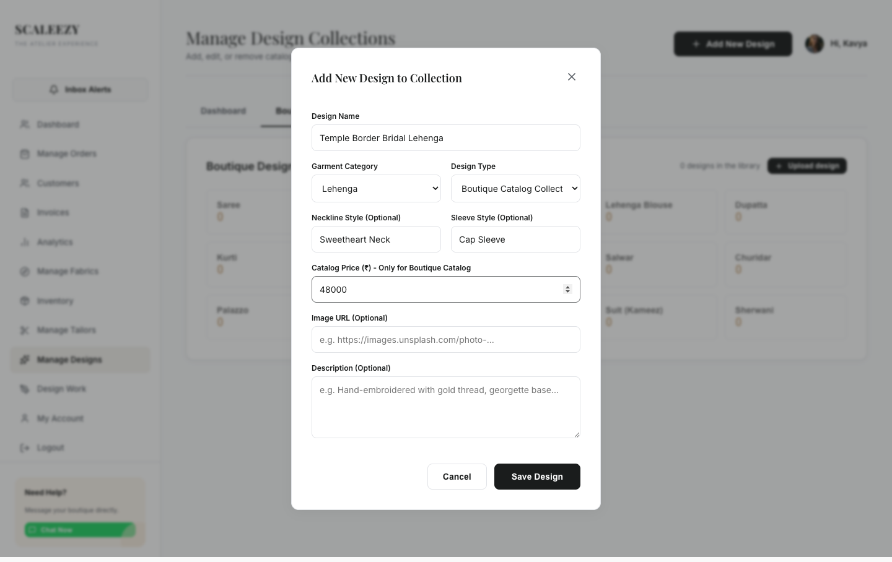

| Field | Notes |
|---|---|
| Design Name | Required |
| Garment Category | Lehenga, Gown, Saree, Kurti, Sherwani, Anarkali — **only these six** |
| Design Type | Boutique Catalog Collection / AI Suggestion Template |
| Neckline Style, Sleeve Style | Optional; feed the match scoring in the order wizard |
| Catalog Price (₹) | Catalogue collection only |
| Image URL | Optional |

> Two behaviours to know before you demo this screen: the category list here is
> six entries, while the library groups by fifteen garments (there is no
> *Blouse* option), and designs added here land under **Uncategorised** in the
> library. Designs uploaded through the Design Studio (§8) categorise correctly.
> See [§31](#31-known-gaps--not-yet-implemented).

---


A designer's account exists for one thing: their own design work. There is no
customer, order or financial navigation, and the API refuses those endpoints
outright.


Same sign-in page. A designer lands on **My Work**.


**Figure 19 — Designer work queue**

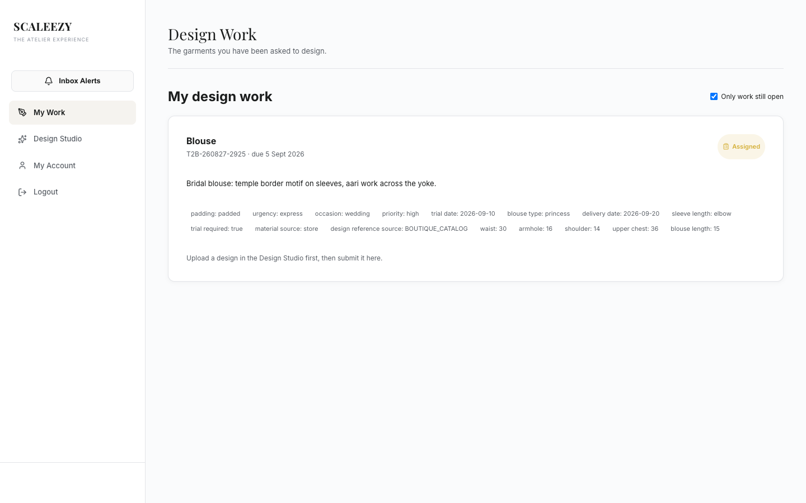

Each item shows the garment, the order id, the due date, the state (*Assigned* →
*Awaiting review* → approved), the owner's brief, and the garment's own spec —
blouse type, sleeve length, padding, occasion, urgency, trial date, and the
measurements. No customer name, no price: the API sends a designer a narrower
payload than it sends the owner.

When nothing has been uploaded yet, the panel says: *Upload a design in the
Design Studio first, then submit it here.*


**Figure 20 — Designer's library view**

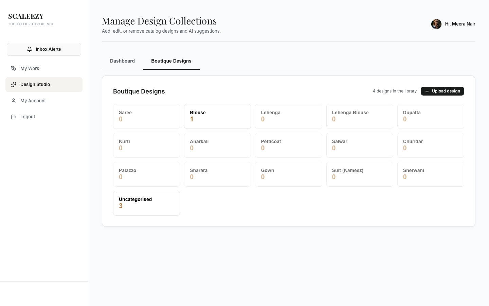

The same library the owner sees, grouped by garment, with an **Upload design**
button.


**Figure 21 — Upload design**

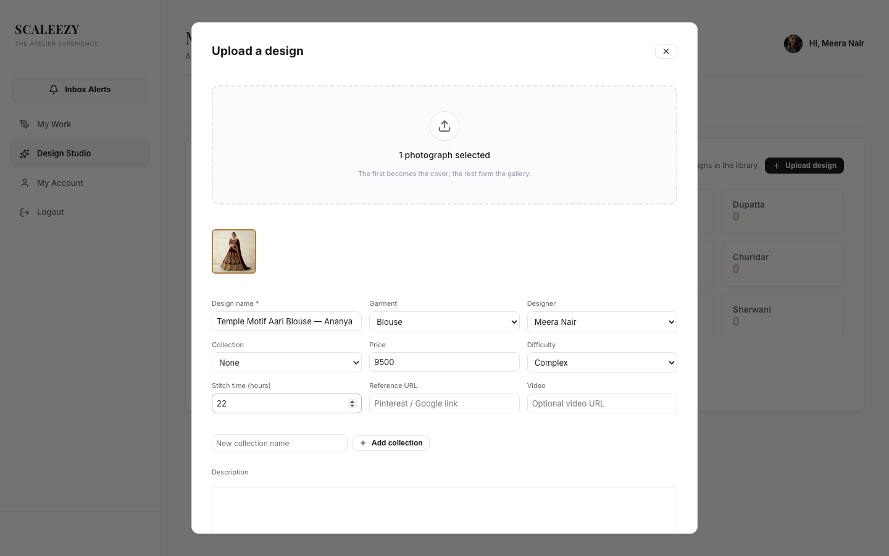

| Field | Notes |
|---|---|
| Images | One or more; the first is the cover |
| Design name * | Required |
| Garment | The full 15-garment list — this is the categorisation that works |
| Designer | Attribution |
| Collection | Only selectable once a designer is chosen |
| Price | Estimated price |
| Difficulty | Simple / Moderate / Complex |
| Stitch hours | Estimate |
| Source URL / Video URL | Optional references |

**Add to library**.

**Figure 22 — Design in the library**

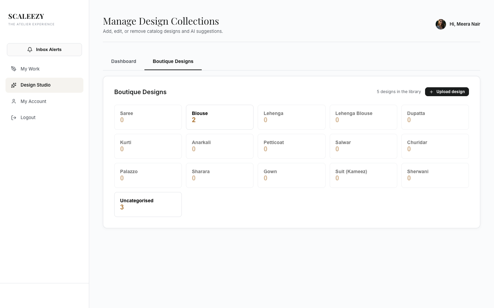


**Figure 23 — Submit design**

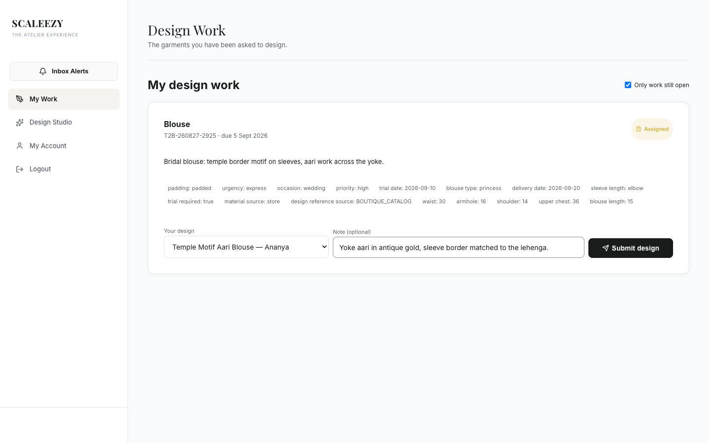

Back on **My Work**, pick the uploaded design, add a note (*Anything the owner
should know*), and press **Submit design**. The item moves to **Awaiting
review**.

**Figure 24 — Submitted**

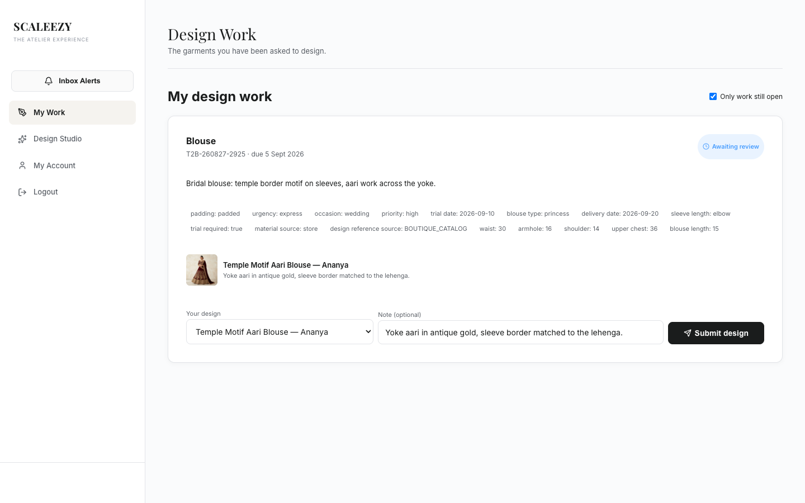


**Figure 25 — Owner reviewing design work**

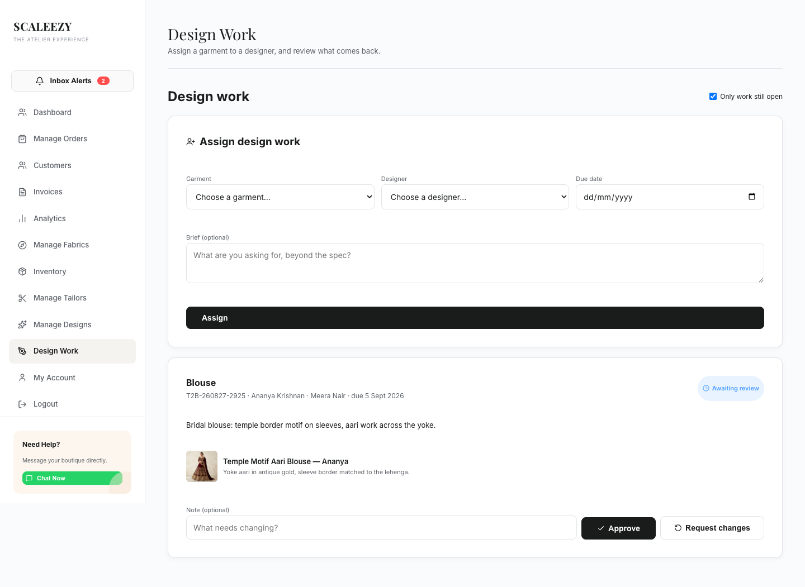

On **Design Work** the owner gets **Approve** or **Request changes** (with a
*What needs changing?* note). Approving closes the item.

**Figure 26 — After approval**


**Figure 27 — Assign design work**

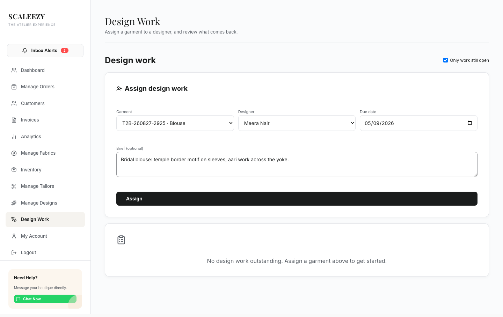

Owner → **Design Work** → pick a garment (the list is *order · garment*, so
design work is always tied to a real garment on a real order), pick the
designer, set a due date, write the brief, **Assign**.

---


Orders are created through a six-step wizard reached from **New Custom Order**
(dashboard or Manage Orders).


```text
Customer (new or existing)
      ↓
Garment(s) chosen         ← one order can carry many garments
      ↓
Per garment: type · occasion · trial · delivery date · urgency · priority
             measurements · style options · materials from stock · notes
      ↓
AI Design Studio          ← ranked design suggestions per garment
      ↓
Fabric Selection          ← boutique fabric or customer's own
      ↓
Master + Stitching Tailor + delivery method
      ↓
Cost breakdown            ← per garment: base, fabric, embroidery, customisation, tailoring
      ↓                     + packaging, discount, GST 5%
Payment                   ← full, partial, or a custom advance
      ↓
ORDER CREATED             ← order id issued, stages generated, customer notified
```


**Figure 28 — New or existing customer**

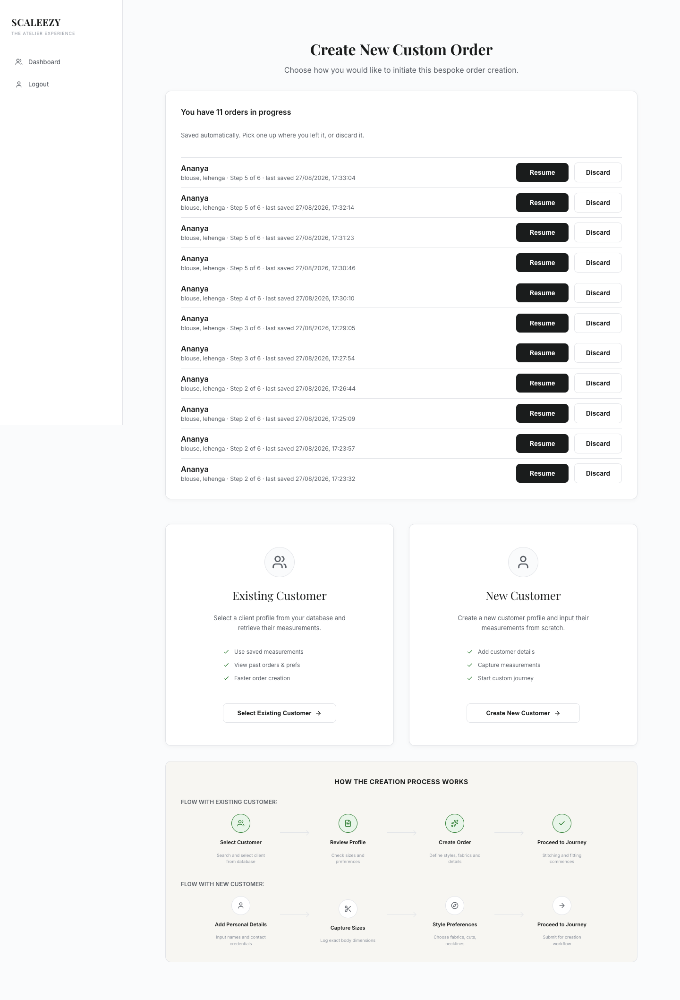

**Select Existing Customer** searches the directory by name or mobile and
carries their saved measurements forward. **Create New Customer** starts a blank
profile.

Any unfinished order is kept as a **draft** and listed on this screen with
**Resume** and **Discard**.

**Figure 29 — Saved drafts**

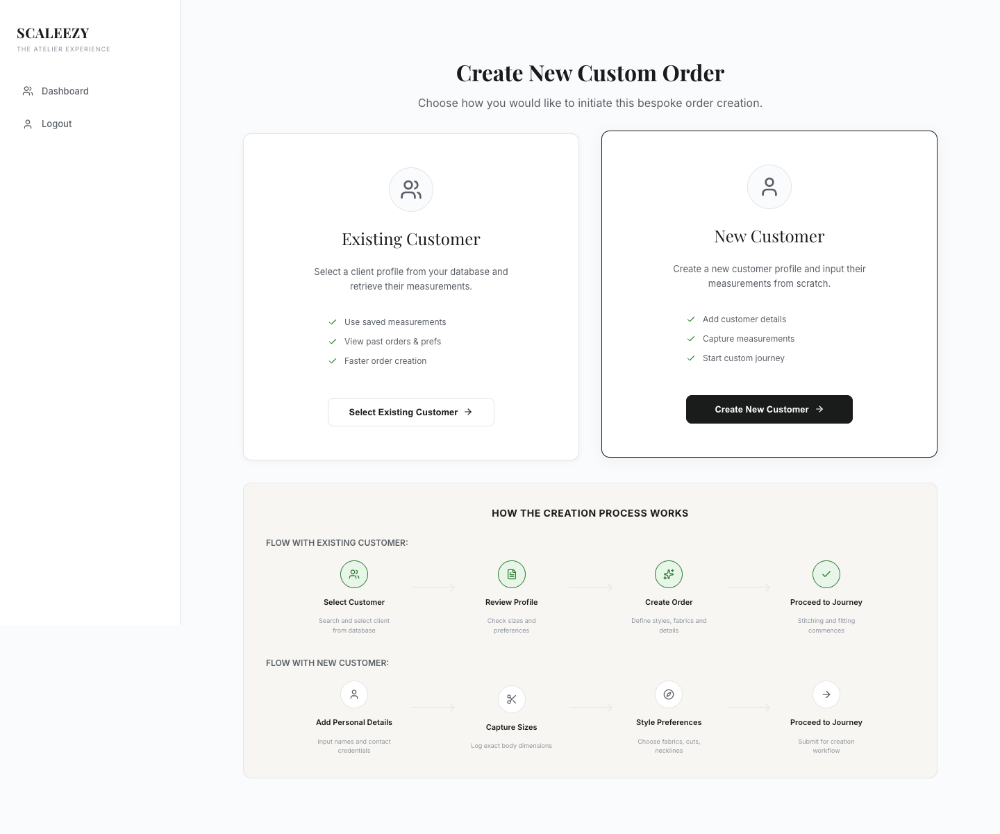


**Figure 30 — Customer details**

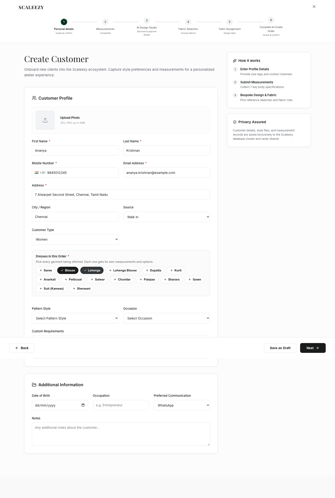

| Field | Required |
|---|---|
| Photo | no |
| First Name, Last Name | yes |
| Mobile Number (+91) | yes |
| Email Address | yes |
| Address | yes |
| City / Region | no |
| Source | Walk In / Instagram / Referral / Website |
| Customer Type | Women / Men / Kids |
| **Dresses in this Order** | **yes** — pick every garment being stitched |
| Fabric / Pattern / Occasion preference, custom requirements, DOB, occupation, preferred channel, notes | no |

The garment picker offers: Saree, Blouse, Lehenga, Lehenga Blouse, Dupatta,
Kurti, Anarkali, Petticoat, Salwar, Churidar, Palazzo, Sharara, Gown, Suit
(Kameez), Sherwani.

**Save as Draft** at any point. **Next** to continue.


**Figure 31 — Garment Details, two garments on one order**

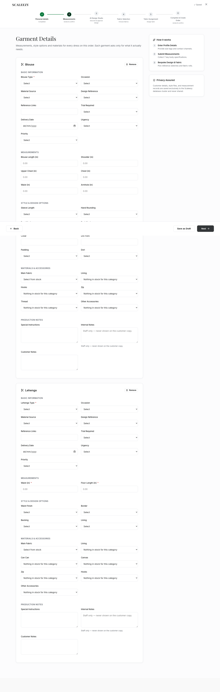

Every garment gets its own card, and each card asks only for what that garment
needs. A Blouse card and a Lehenga card do not contain the same fields.

**Figure 32 — Blouse card, filled**

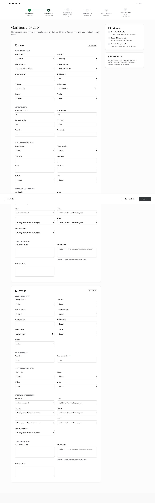

**Figure 33 — Lehenga card, filled**

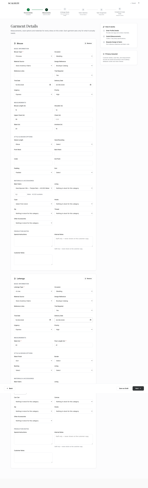

Five sections per card:

| Section | Contents (Blouse example) |
|---|---|
| **Basic information** | Blouse Type * (Plain / Princess / One-Tuck / Three Point / Katori / Portable Katori) · Occasion · Material Source (Customer Provided / Store Inventory / Mixed) · Design Reference (Boutique Catalog / Pinterest / Google Images / Customer Sketch / Designer Sketch / Previous Design) · Reference Links · Trial Required → **Trial Date** · Delivery Date · Urgency (Normal / Express) · Priority (Low / Medium / High) |
| **Measurements** | Blouse Length, Shoulder, Upper Chest, Chest, Waist, Armhole (inches) |
| **Style & design options** | Sleeve Length · Hand Rounding (HR1–HR4) · Front Neck · Back Neck · Collar · Dot Point · Padding · Dori |
| **Materials & accessories** | Main Fabric, Lining, Hooks, Zip, Thread, Other Accessories — each a **live pick from inventory stock**, with a quantity |
| **Production notes** | Special Instructions · Internal Notes (*staff only — never shown on the customer copy*) · Customer Notes |

A Lehenga card instead asks Lehenga Type * (A-Line / Circular / Mermaid /
Straight Cut / Panelled (Khalis)), Waist * and Floor Length *, and style options
Waist Finish / Border / Backing / Lining.

> **Trial Date becomes required** the moment *Trial Required* is set to Yes.
> If **Next** appears to do nothing, this is almost always why.


**Figure 34 — Design suggestions per garment**

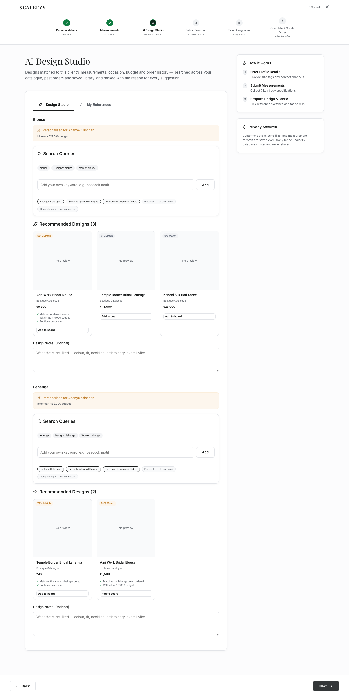

Per garment, the product searches your boutique catalogue, your saved and
uploaded designs and the customer's previously completed orders, then ranks what
it finds against this client's measurements, occasion, budget and history. Each
card carries a **match percentage** and the reasons — *Matches preferred sleeve*,
*Within the ₹15,000 budget*, *Boutique best seller*.

Editable **Search Queries** chips sit above the results. Pinterest and Google
Images are listed as sources but read **not connected**.

**Add to board** shortlists a design for that garment.

**Figure 35 — Design shortlisted**

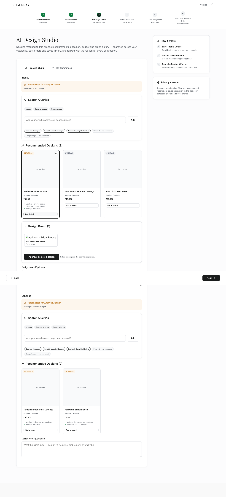


**Figure 36 — Fabric Selection**

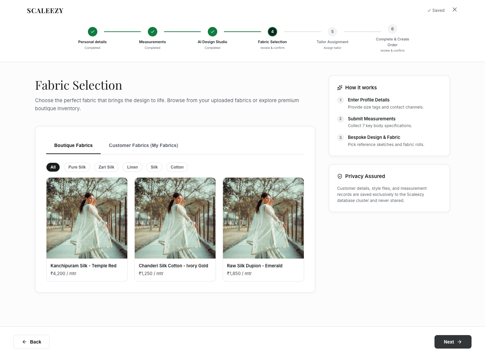

Two tabs — **Boutique Fabrics** and **Customer Fabrics (My Fabrics)** — filtered
by material. Fabric cards show name, colour and price per metre.

**Figure 37 — Fabric chosen**

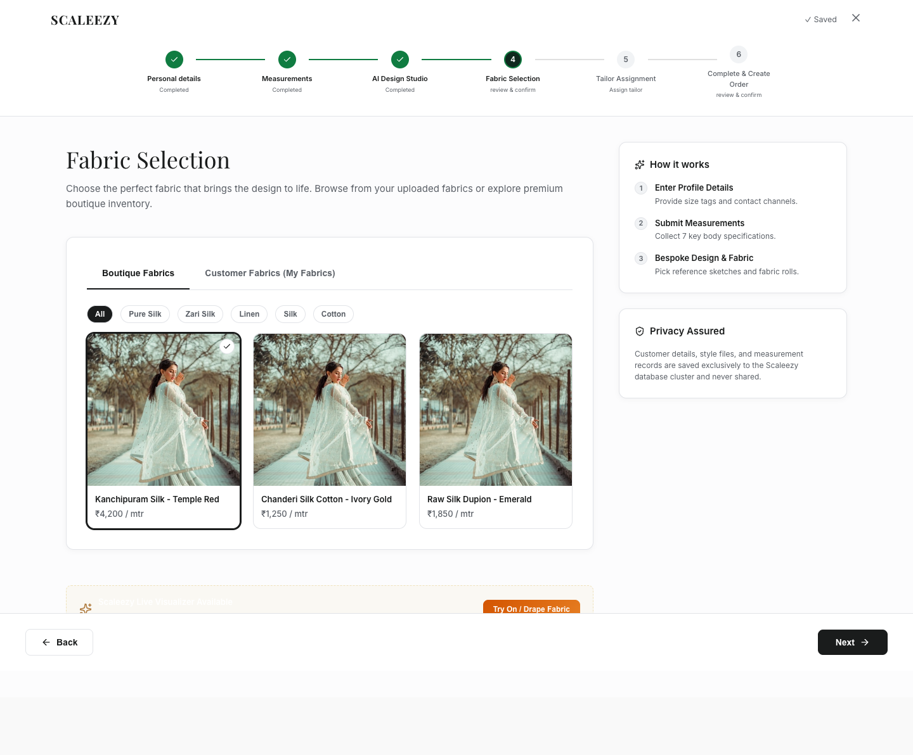

Choosing a fabric reveals the **Scaleezy Live Visualizer** — see
[§20 Try-On](#20-try-on).


**Figure 38 — Review & Staff Assignment**

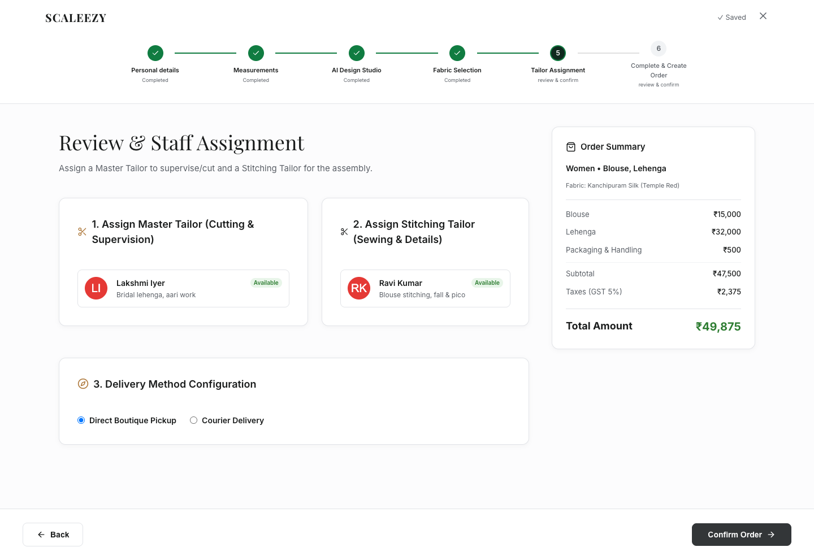

1. **Assign Master Tailor** — supervision and cutting.
2. **Assign Stitching Tailor** — assembly.
3. **Delivery Method** — Direct Boutique Pickup or Courier Delivery.
4. **Order Summary** — per-garment prices, packaging, subtotal, GST, total.

**Figure 39 — Staff assigned**

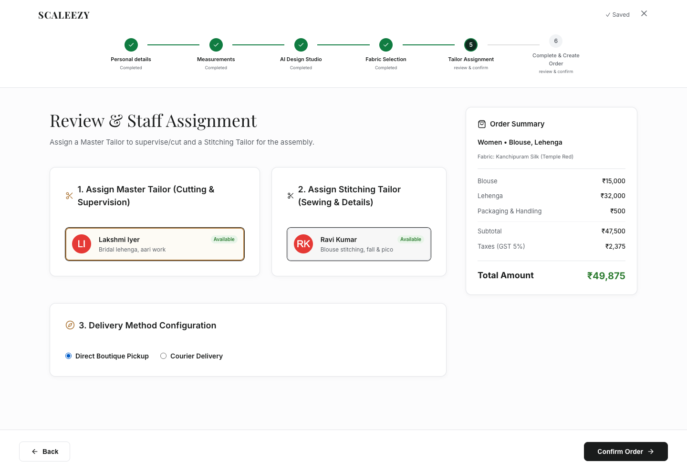


**Figure 40 — Review & Complete Order**

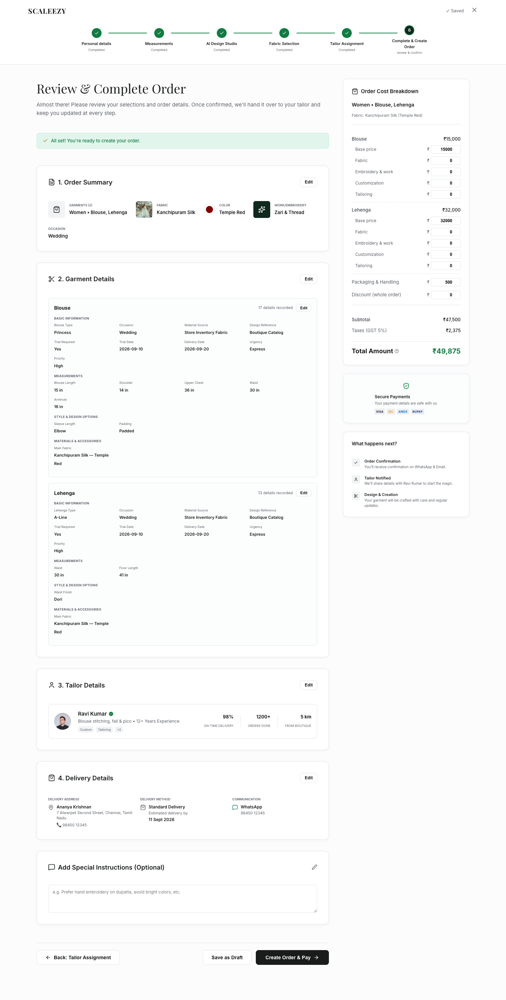

The full order plays back: garments, fabric, colour, work, occasion, then each
garment's recorded details, then the **Order Cost Breakdown** where every
garment can be split into Base price / Fabric / Embroidery & work /
Customization / Tailoring, plus order-level Packaging & Handling and Discount.

Default base prices are per garment type — Lehenga ₹32,000, Sherwani ₹35,000,
Gown ₹25,000, Suit ₹22,000, Anarkali ₹18,000, Saree ₹15,000, Kurti ₹5,000,
anything else ₹15,000. Packaging defaults to ₹500 and **GST is fixed at 5%**.

**Create Order & Pay** →


**Figure 41 — Payment options**

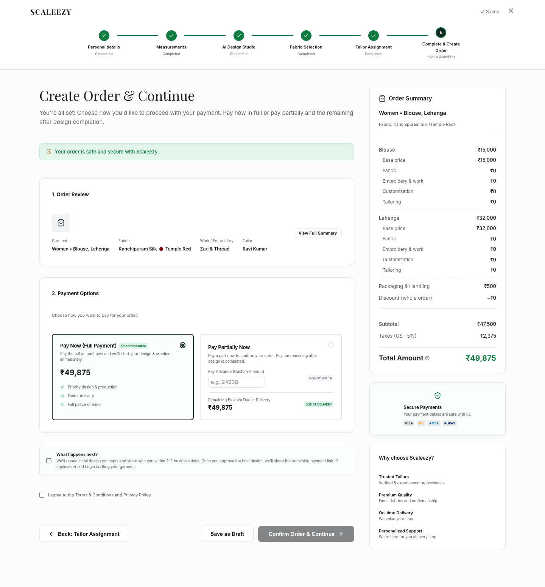

| Option | Effect |
|---|---|
| **Pay Now (Full Payment)** | Records the whole amount; order is *Paid* |
| **Pay Partially Now** | Reveals **Pay Advance (Custom Amount)**; the balance is due at delivery |

**Figure 42 — Advance recorded**

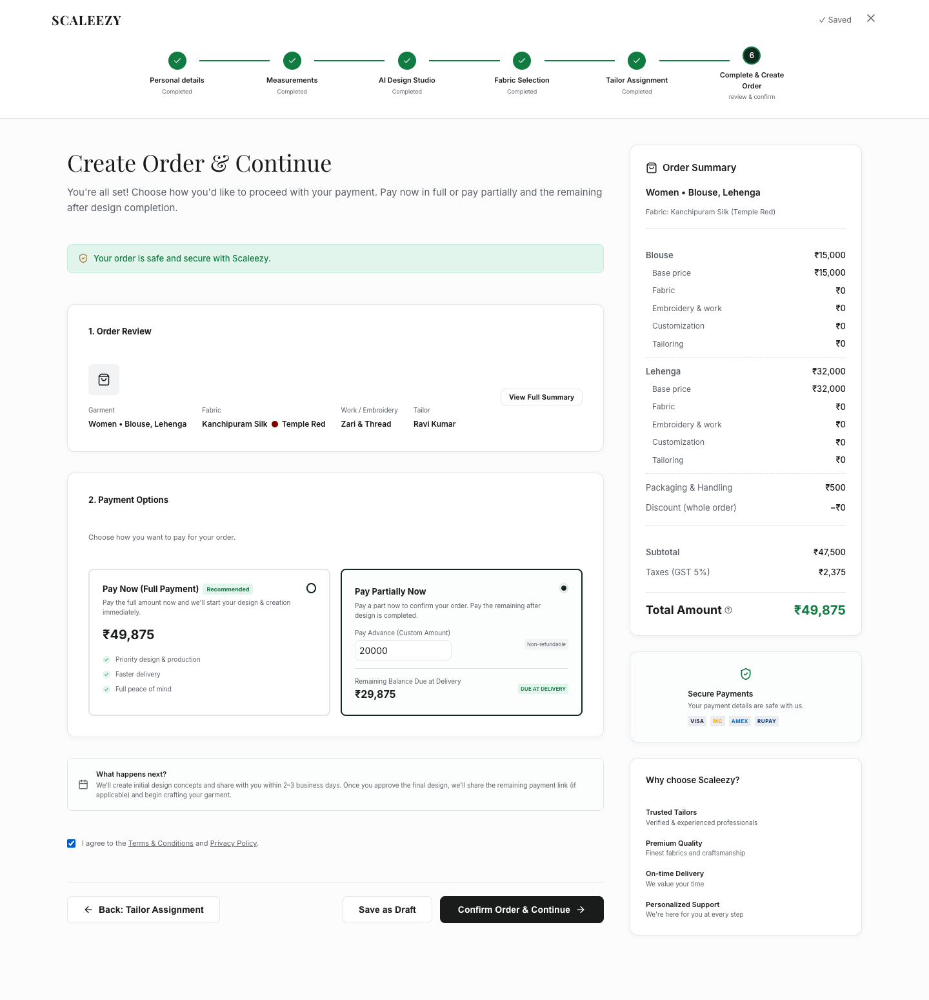

Tick the Terms & Conditions box and press **Confirm Order & Continue**.

**Figure 43 — Order confirmed**

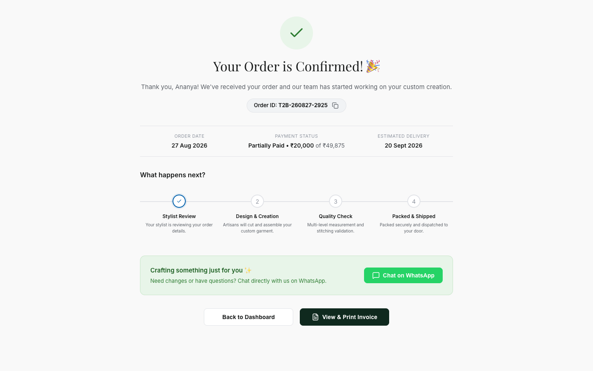

The confirmation carries the **Order ID** (format `T2B-YYMMDD-nnnn`), order date,
payment status (*Partially Paid • ₹20,000 of ₹49,875*), estimated delivery, the
four customer-facing milestones, **Chat on WhatsApp**, **Back to Dashboard** and
**View & Print Invoice**.


**Figure 44 — Atelier Orders Registry**

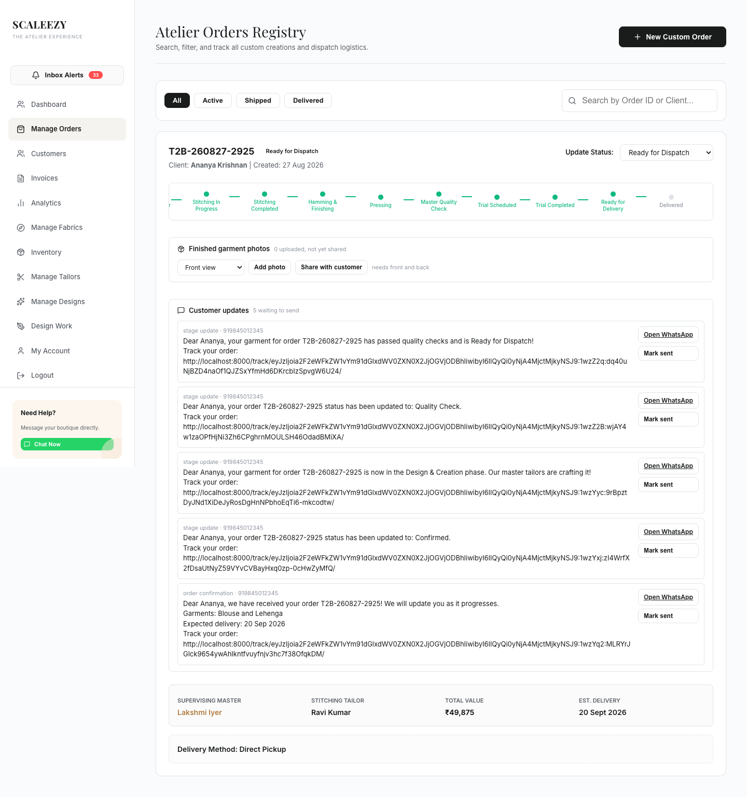

Search by order id or client; filter **All / Active / Shipped / Delivered**.
Each order card carries:

- **Update Status** — Received, Confirmed, Stylist Review, Design & Creation,
  Quality Check, Ready for Dispatch, Shipped, Delivered.
- The **15 production stages**, clickable.
- **Finished garment photos** — nine view slots (front, back, left, right,
  close-up, fabric texture, sleeve detail, blouse detail, dupatta styling).
- **Customer updates** — the queued WhatsApp messages.
- Supervising Master, Stitching Tailor, total value, estimated delivery,
  delivery method.

---


One order carries as many garments as the customer is having made, and the
product keeps them separate all the way through.

Pick them in step 1 under **Dresses in this Order**. From then on:

| Level | What is per-garment | What is per-order |
|---|---|---|
| Garment card | type, occasion, trial, delivery date, urgency, priority | — |
| Measurements | its own set, drawn from that garment's template | — |
| Design | its own shortlist and its own AI suggestions | — |
| Materials | its own inventory picks and quantities | — |
| Price | its own base / fabric / embroidery / customisation / tailoring | packaging, discount, GST, total |
| Design work | assigned per garment (*order · garment*) | — |
| Production stages | — | one set of 15 stages for the order |
| Status, payment, invoice, tracking | — | one per order |

Worked example — the demo order:

```text
Order T2B-260827-2925
Customer: Ananya Krishnan
Garments:
  1. Blouse   Princess · Elbow sleeve · Padded · ₹15,000
              Blouse length 15", Shoulder 14", Upper chest 36", Waist 30", Armhole 16"
              Main fabric: Kanchipuram Silk — Temple Red · 1.2 m from stock
  2. Lehenga  A-Line · Dori waist finish · ₹32,000
              Waist 30", Floor length 41"
              Main fabric: Kanchipuram Silk — Temple Red · 4.5 m from stock
Packaging ₹500 · Subtotal ₹47,500 · GST 5% ₹2,375 · Total ₹49,875
```

Note what is **not** per-garment: production stages are order-level. A single
"Stitching In Progress" covers every garment on the order.

---


Inside the order wizard, on each garment's card — because which measurements are
needed depends on the garment. A Blouse asks for six; a Lehenga asks for two,
both required.


Against the **customer**, not only the order. The customer profile shows the
current set plus **Sizing Version History** — every earlier set, dated. Taking
new measurements adds a version; it does not overwrite.


Production staff see them on their own dashboard, per garment, under
**📏 MEASUREMENTS AS ORDERED** — and again inside every stage-update modal, so a
tailor never has to leave the stage they are working on to check a number.

**Figure 45 — Measurements as the Master sees them**

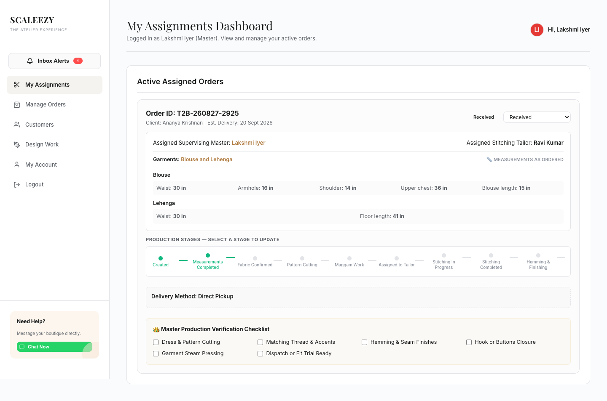


Choosing **Select Existing Customer** in step 0 carries the saved measurements
into the new order; the card is pre-filled and can be adjusted for this garment.

---


Seven panels: **Items · Catalogue · Locations · Recipes · Purchase Orders ·
Suppliers · Reports**. Four headline figures sit above all of them — Stock
Value, Out of Stock, Reorder Due, Dead Stock (no movement in 90 days).


**Figure 46 — Inventory items**

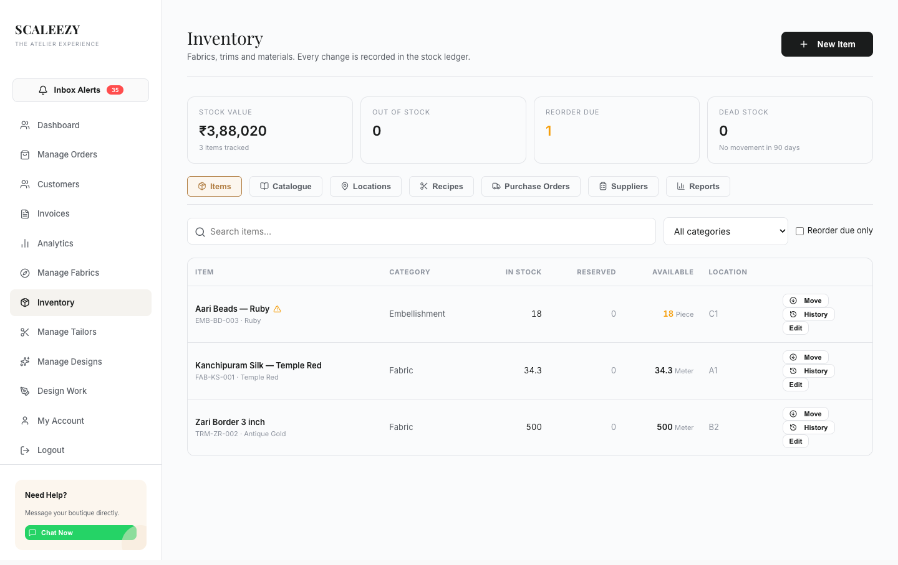

Filter by category — Fabric, Border & Trim, Lining, Embellishment, Stitching
Material, Packaging, Maggam / Embroidery, Other — or by **Reorder due only**.
Each row shows in stock, reserved, available, location, and the actions
**Move**, **History** and **Edit**.


**Figure 47 — New inventory item**

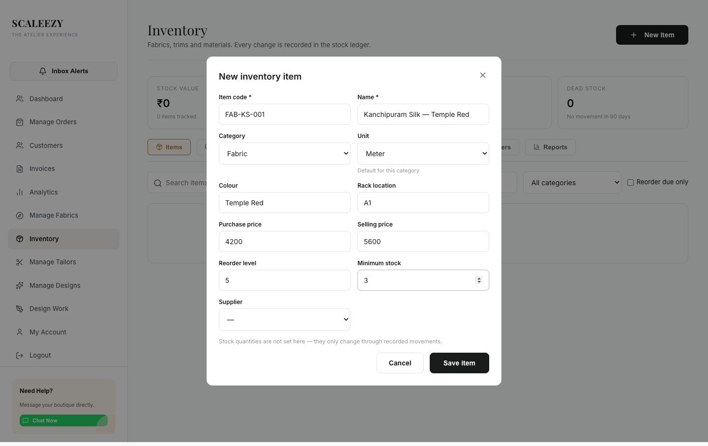

Item code * · Name * · Category · Unit (defaults per category) · Colour · Rack
location · Purchase price · Selling price · Reorder level · Minimum stock ·
Supplier.

> **Stock quantities are not set here.** The form says so: *Stock quantities are
> not set here — they only change through recorded movements.* This is
> deliberate; the ledger is the only source of truth for a number.


**Figure 48 — Stock movement**

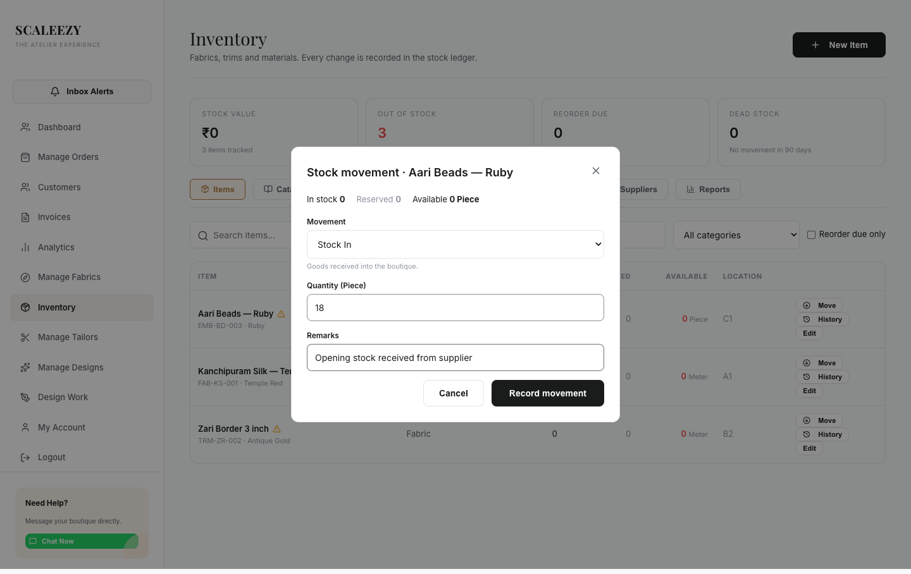

| Movement | Meaning |
|---|---|
| Stock In | Goods received into the boutique |
| Reserve | Spoken for by an order, still on the shelf |
| Release | Cancel a reservation |
| Issue to production | Handed to the workroom; leaves the shelf |
| Consume | Actually used up on a garment |
| Waste | Offcuts and loss during production |
| Return | Unused material back from the workroom |
| Adjust | Set to a counted total after a stock take |

Order-linked movements can name the order (needed for cost-per-order and
consumption reports) and stock-outs can name the location they leave from.


This is automatic, and it is one of the strongest things to demonstrate:

```text
Item created                       stock 0
      ↓  Stock In movement
Stock available                    40.000 m
      ↓  Garment card: "Main Fabric" picked from stock, quantity 1.2 + 4.5
Order created                      choice stored on the garment
      ↓  Production reaches "Fabric Confirmed"
RESERVATION written                available falls, in-stock unchanged
      ↓  Production reaches the stitching stages
CONSUMPTION written                in-stock falls  40.000 → 34.300
      ↓  Order delivered
Reservations released and reconciled
```

Verified on the demo order: Kanchipuram Silk went from 40.000 m to 34.300 m —
exactly the 1.2 m and 4.5 m chosen on the two garment cards, with
`RESERVATION` and `CONSUMPTION` rows in the ledger against order 1.


When a movement takes an item to or below its reorder level, a notification is
raised: *Reorder level reached: Aari Beads — Ruby (EMB-BD-003) is down to 18.000
Piece, at or below its reorder level of 20.000.* The **Reorder Due** tile counts
them.


| Panel | What it is | Screenshot |
|---|---|---|
| **Catalogue** | A shipped reference catalogue of materials — base fabrics, embroidery and metallic threads, needles, frames, bead families, and more — to create items from rather than typing them | [16-1](screenshots/owner/16-1-inventory-catalogue.png) |
| **Locations** | Where stock physically sits; per-item breakdown and transfers | [16-2](screenshots/owner/16-2-inventory-locations.png) |
| **Recipes** | A bill of materials per garment. *An order reserves against the recipe.* | [16-3](screenshots/owner/16-3-inventory-recipes.png) |
| **Purchase Orders** | Raise a PO against a supplier, receive against it | [16-4](screenshots/owner/16-4-inventory-purchase-orders.png) |
| **Suppliers** | Supplier records | [16-5](screenshots/owner/16-5-inventory-suppliers.png) |
| **Reports** | Date-ranged stock value, in stock, reserved, available, at reorder level, out of stock, plus waste and damage rates | [16-6](screenshots/owner/16-6-inventory-reports.png) |

---


The Master lands on **My Assignments Dashboard** — *Logged in as Lakshmi Iyer
(Master).*


**Figure 49 — Master's assignments**


1. Order id, client, estimated delivery, order status.
2. Assigned Supervising Master and Stitching Tailor.
3. Garments on the order.
4. **📏 Measurements as ordered**, per garment.
5. **Production stages — select a stage to update**.
6. Delivery method.
7. **👑 Master Production Verification Checklist** — Dress & Pattern Cutting,
   Matching Thread & Accents, Hemming & Seam Finishes, Fall & Pico (sarees
   only), Hook or Buttons Closure, Garment Steam Pressing, Dispatch or Fit Trial
   Ready.


**Figure 50 — Stage update modal**

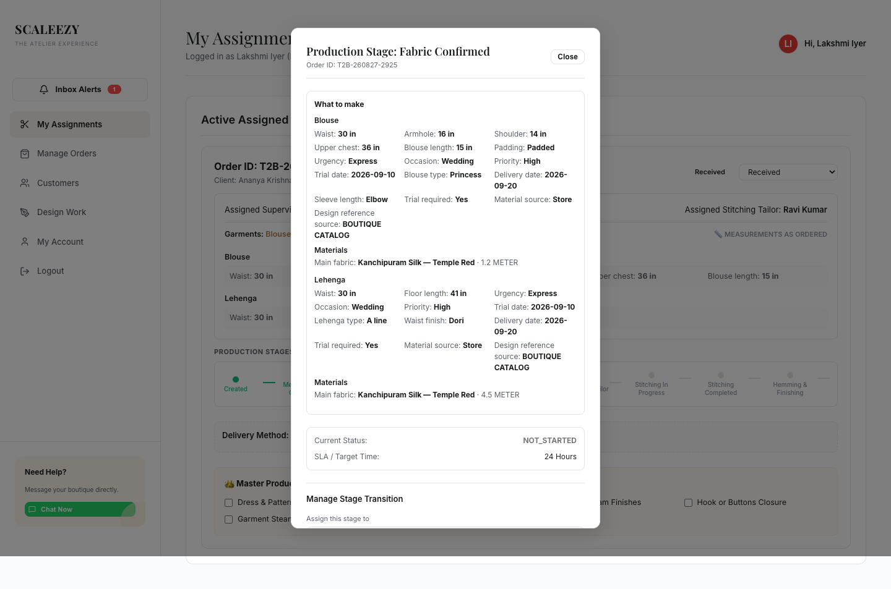

The modal shows the full garment spec and materials, the current status and the
SLA target, then **Manage Stage Transition**:

| Control | Purpose |
|---|---|
| Assign this stage to | Hand the stage to a named person |
| Record who performed this | Credit the work |
| Comments / Fitting Logs | Notes against the stage |
| Upload Progress Photo | Attach an image |
| **Start In-Progress** | NOT_STARTED → IN_PROGRESS |
| **Pause Stage** | back to paused |
| **Complete Stage** | → COMPLETED |
| **Skip Stage** | for optional stages, e.g. Maggam Work on a garment with no embroidery |

**Figure 51 — A stage in progress**


Can: run every stage their role owns, assign stages, read the whole floor and
the customers behind it, upload and publish finished-garment photos, complete
the verification checklist, view Manage Orders, Customers and Design Work.

Cannot: create or edit customers, touch inventory, record payments, change
prices, or open boutique settings.


| Screen | Screenshot |
|---|---|
| Manage Orders | [51](screenshots/master/51-master-manage-orders.png) |
| Customers | [52](screenshots/master/52-master-customers.png) |
| Design Work | [53](screenshots/master/53-master-design-work.png) |
| My Account | [54](screenshots/master/54-master-my-account.png) |

Specialist roles (QC Master and the rest) get the same **My Assignments** screen,
narrowed to orders sitting on their own stage —
[55](screenshots/master/55-qc-my-assignments.png).

---


A Stitching Tailor lands on **My Assignments Dashboard** — *Logged in as Ravi
Kumar (Tailor).* The sidebar has two items: **My Assignments** and **My
Account**. That is the whole application for a tailor, by design.

**Figure 52 — Tailor's assignments**

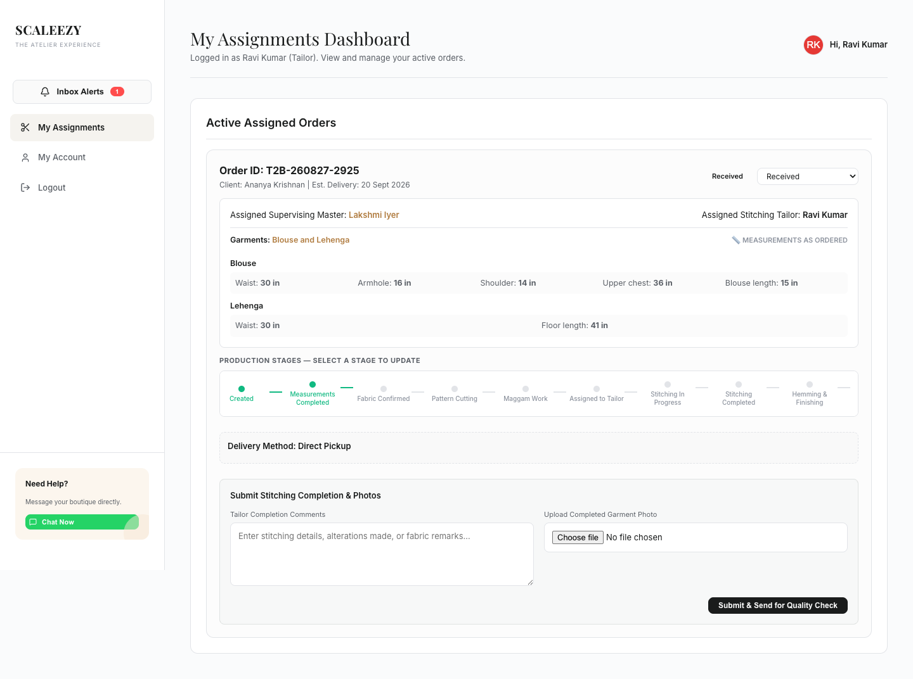


Everything needed to stitch, and nothing else:

- Order id, client name, estimated delivery.
- Who the supervising Master is.
- The garments on the order.
- **Measurements as ordered**, per garment.
- The garment spec — blouse type, sleeve length, padding, dori, neck details.
- The materials chosen, with quantities.
- Special instructions and customer notes. **Internal notes are not shown to
  the customer**, but staff do see them.

No prices, no payment status, no other order on the floor.


**Figure 53 — Tailor updating the stitching stage**

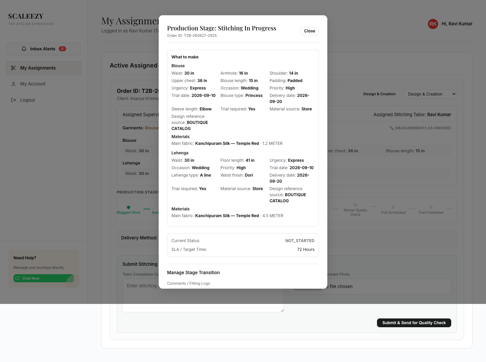

Click **Stitching In Progress** → **Start In-Progress**. Log comments and
progress photos as you go. When the garment is assembled, reopen and **Complete
Stage**, then do the same for **Stitching Completed**.

**Figure 54 — Stitching complete, handed back**

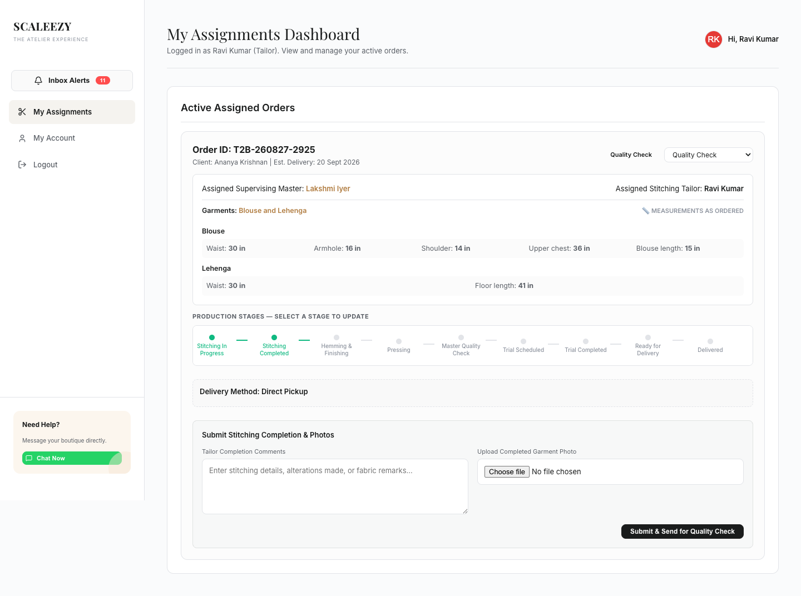

The handoff is implicit and automatic: completing *Stitching Completed* leaves
the next stage, *Hemming & Finishing*, owned by the Master.

A tailor cannot advance a stage that belongs to another role. The buttons are
not offered.

---


| # | Stage | SLA | Who may advance it |
|---|---|---|---|
| 1 | Created | 12 h | Owner, Master |
| 2 | Measurements Completed | 24 h | Owner, Master, Measurement Master |
| 3 | Fabric Confirmed | 24 h | Owner, Master |
| 4 | Pattern Cutting | 24 h | Owner, Master, Pattern Master, Cutting Master |
| 5 | Maggam Work *(optional)* | 96 h | Owner, Master, Maggam Master |
| 6 | Assigned to Tailor | 12 h | Owner, Master |
| 7 | Stitching In Progress | 72 h | Owner, **Tailor** |
| 8 | Stitching Completed | 12 h | Owner, **Tailor** |
| 9 | Hemming & Finishing | 24 h | Owner, Master, Finishing Master |
| 10 | Pressing | 12 h | Owner, Master, Pressing Staff |
| 11 | Master Quality Check | 12 h | Owner, Master, QC Master |
| 12 | Trial Scheduled | 48 h | Owner, Master |
| 13 | Trial Completed | 24 h | Owner, Master |
| 14 | Ready for Delivery | 24 h | Owner, Master |
| 15 | Delivered | 12 h | Owner, Master |

Stage 5 is optional — use **Skip Stage** on a garment with no embroidery; a
skipped stage does not block delivery.


```text
                         OWNER
                           │  creates the order, assigns the team,
                           │  handles money, publishes photos
        ┌──────────────────┼──────────────────┐
        │                  │                  │
    DESIGNER            MASTER            TAILOR
   design work        stages 1–6,        stages 7–8
   on request         9–15, QC           stitching
        │                  │                  │
        └──────────────────┼──────────────────┘
                           │
                    ORDER STAGES 1..15
                           │
              inventory reserved → consumed
                           │
                    CUSTOMER TRACKING LINK
```


Two different things, both on the order card:

- **Order status** (8 values) is the commercial state shown to the customer:
  Received → Confirmed → Stylist Review → Design & Creation → Quality Check →
  Ready for Dispatch → Shipped → Delivered.
- **Production stage** (15 values) is the shop-floor state.

Advancing stages moves the order status along on its own — completing the
production ladder took the demo order to *Ready for Dispatch* without anyone
touching the status dropdown.

---


Payments are recorded at two points.


Full payment, partial payment, or a custom advance amount — see
[§9](#payment-and-confirmation). The advance is marked **non-refundable** on the
screen.


**Figure 55 — Invoices & Billing**

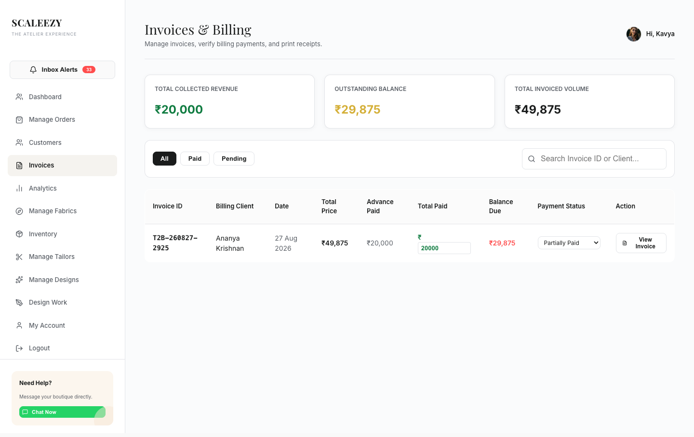

Three figures across the top: **Total Collected Revenue**, **Outstanding
Balance**, **Total Invoiced Volume**.

The table carries one row per order — Invoice ID, Billing Client, Date, Total
Price, Advance Paid, **Total Paid** (editable), Balance Due, **Payment Status**
(Pending / Partially Paid / Paid) and **View Invoice**.

To record the balance: type the new total received into **Total Paid**, press
Enter, then set **Payment Status** to *Paid*.

**Figure 56 — Settled**

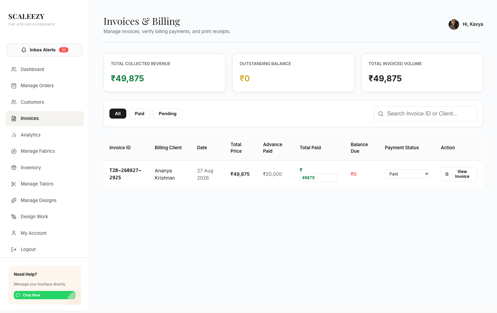

Collected revenue ₹49,875, outstanding ₹0.

> There is no card gateway. The payment screens at checkout show card-network
> logos but nothing is charged — payment is **recorded**, taken by whatever means
> the boutique already uses. See [§31](#31-known-gaps--not-yet-implemented).

---


**Figure 57 — Invoice**

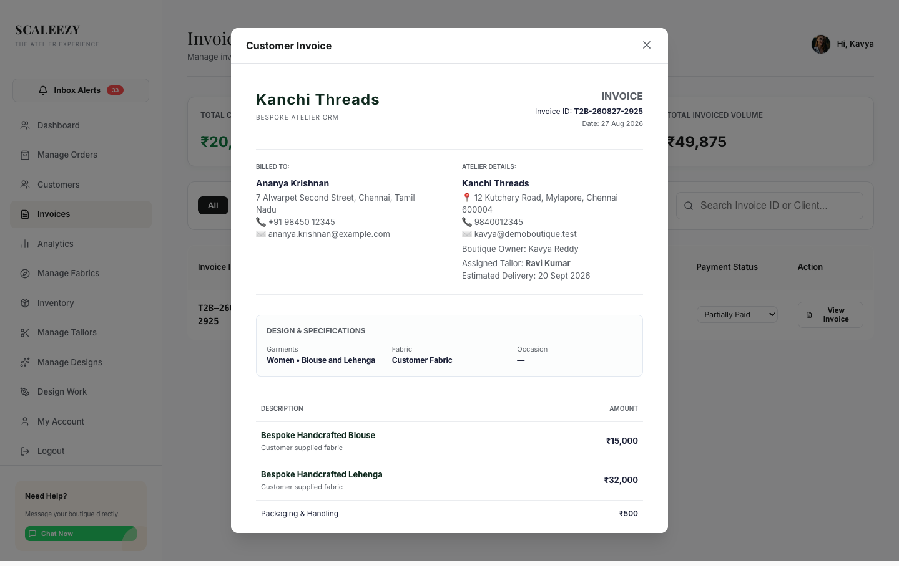

Reached from **Invoices → View Invoice**, or from **View & Print Invoice** on
the order-confirmation screen.

Contains: boutique identity (name, address, phone, email from My Account),
invoice/order id and date, the customer's details, the garments with their
prices, packaging, discount, subtotal, GST at 5%, total, amount paid and balance
due. **Print Invoice** opens the browser print dialog — use *Save as PDF* there
to produce a file.

The invoice number **is** the order id; there is no separate invoice sequence.

> Each garment line also carries a fabric note — *Includes boutique fabric —
> ₹x*, or *Customer supplied fabric*. That note is decided by whether a fabric
> price was typed into the step-6 breakdown, **not** by the garment's recorded
> material source, so a garment cut from boutique stock with no fabric price
> entered prints as customer-supplied. Fill in the Fabric field on the cost
> breakdown to avoid it — see [§31.10](#3110-the-invoice-can-tell-customers-they-supplied-their-own-fabric-when-they-did-not).

---


What the product actually does — and does not do — matters here.

**It composes messages. It does not send them.**

**Figure 58 — Queued customer updates**

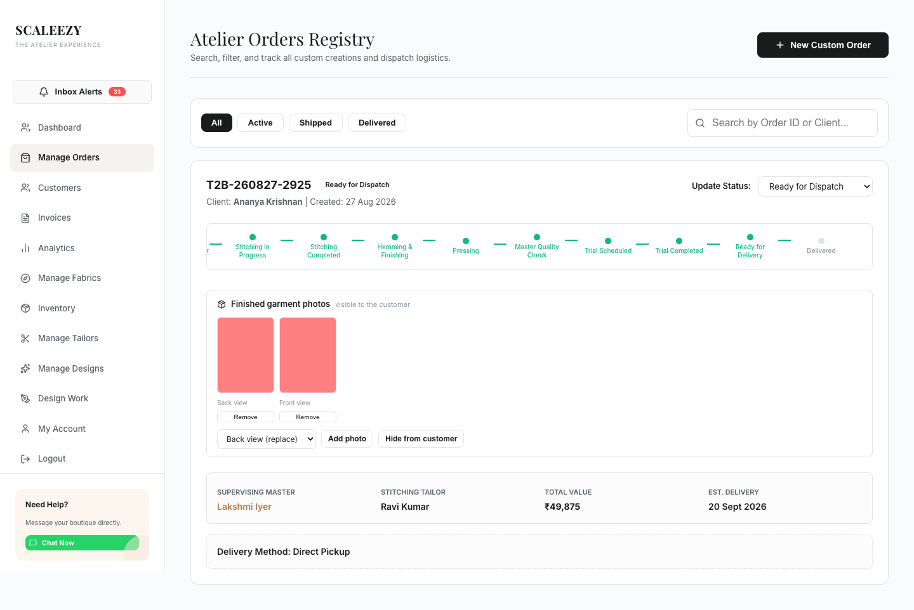

On each order card, **Customer updates** lists messages waiting to go, each with
its type and the destination number, e.g. *order confirmation · 919845012345*:

```text
Dear Ananya, we have received your order T2B-260827-2925! We will update you
as it progresses.
Garments: Blouse and Lehenga
Expected delivery: 20 Sep 2026
Track your order: http://localhost:8000/track/eyJzIjoia2F2eWFkZW1v…/
```

Two buttons: **Open WhatsApp** — opens WhatsApp with the message pre-filled to
that number, where a human presses send — and **Mark sent**, which clears it
from the queue.

Messages are queued automatically as the order progresses: order confirmation,
status changes, and readiness.


**Figure 59 — Photos uploaded**

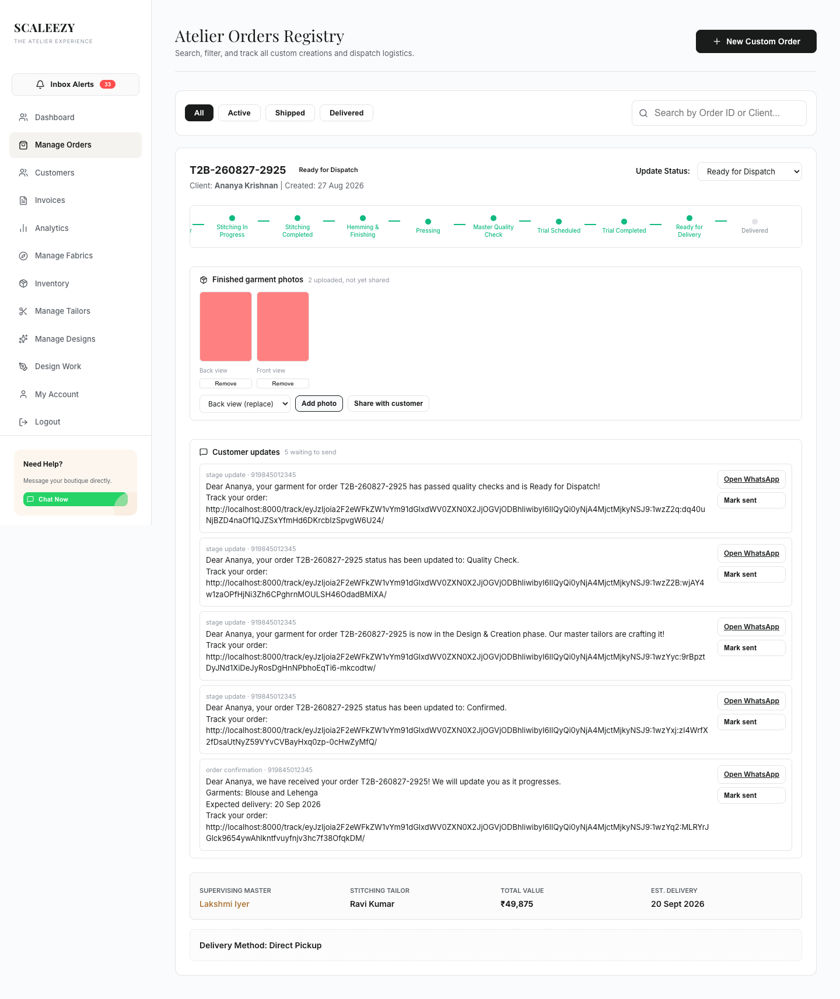

Nine view slots. Upload against a view, then press **Share with customer** —
until you do, the panel reads *not yet shared* and the customer sees nothing.
The button warns when the minimum (front and back) is not met.

**Figure 60 — Shared**

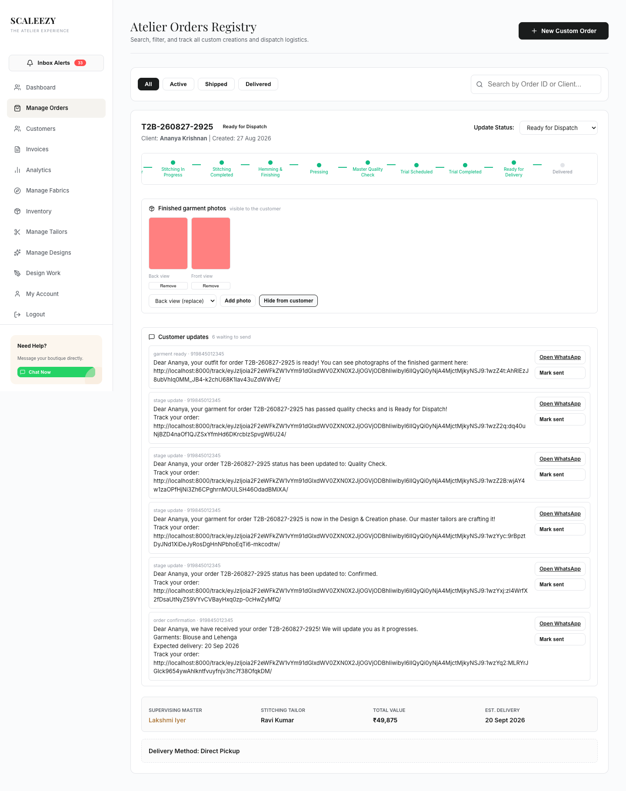

Once shared the panel reads *visible to the customer* and offers **Hide from
customer**.

Only the Owner and the Master may upload or publish photos.

---


The customer never signs in. They open the link from the WhatsApp message.

**Figure 61 — The customer's tracking page**

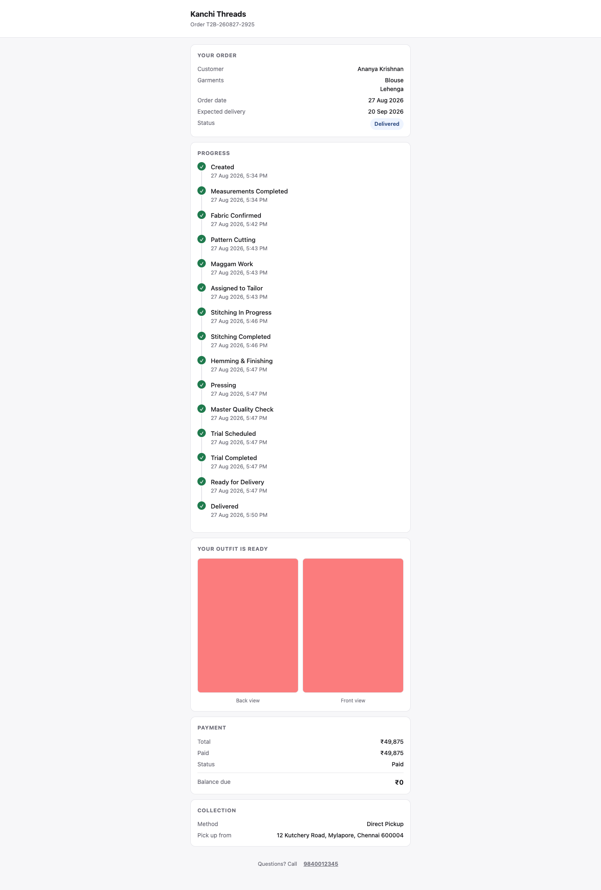

The URL is `/track/<signed-token>/`. The token is signed and carries the
boutique's schema and the order id, so a link works only for the order it was
issued for and cannot be edited into someone else's order.

The page is rendered by Django — no app, no login, no JavaScript framework —
and shows:

| Block | Contents |
|---|---|
| Header | Boutique name, order id |
| **Your order** | Customer, garments, order date, expected delivery, status |
| **Progress** | All 15 stages; completed ones ticked and timestamped to the minute |
| **Your outfit is ready** | The published finished-garment photos (only once shared) |
| **Payment** | Total, paid, status, balance due |
| **Collection** | Method, and the pickup address or courier details |
| Footer | The boutique's phone number |

What the customer never sees: internal notes, staff names, other orders, prices
of individual components, or anything belonging to another boutique.


Read the page, and telephone the number at the bottom. There is no reply box, no
approval button, no login, no document upload. Everything else runs through
WhatsApp with a human at each end.

---


**Figure 62 — Scaleezy Live Visualizer**

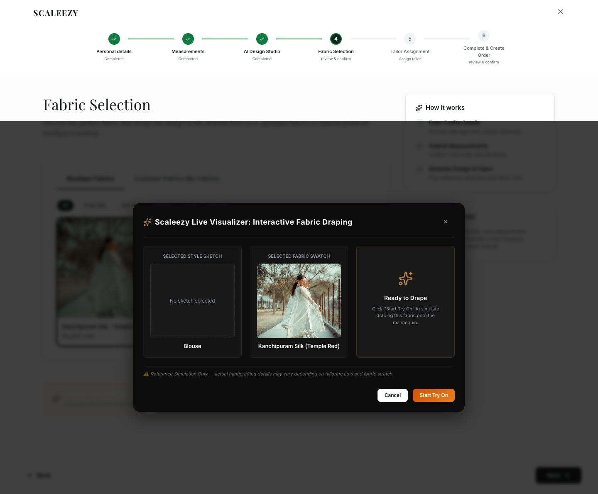

Where it is: order wizard, **step 4 Fabric Selection**, after a fabric is
chosen — a banner reading *Scaleezy Live Visualizer Available* with a **Try On /
Drape Fabric** button.

What it does: opens a modal with three panels — Selected Style Sketch, Selected
Fabric Swatch, and *✨ 3D Mannequin Draped View*. **Start Try On** shows a
two-second *Simulating Try On…* animation, then fills the third panel.

**Figure 63 — After Start Try On**

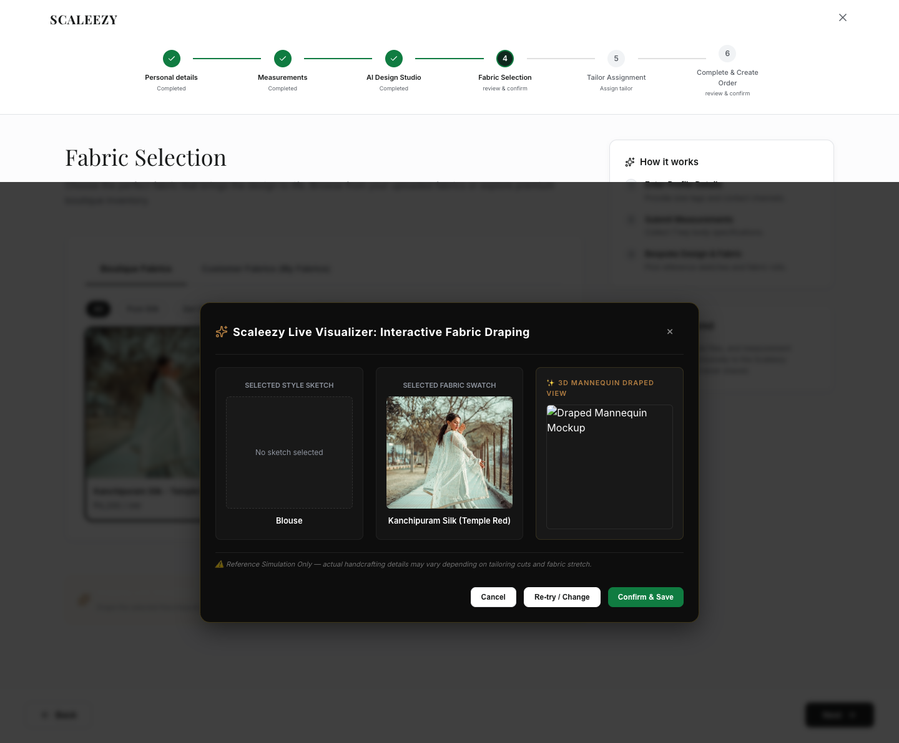

**Be straight about this in a demo.** It is a mock:

- The "draped view" is a **stock photograph picked by fabric colour keyword**
  (rose/pink → one Unsplash image, gold/yellow → another, and so on). Nothing is
  rendered, and the customer's garment, measurements and design are not used.
- The two-second wait is a `setTimeout`, not a computation.
- The images are hot-linked to Unsplash, so with no internet the panel shows a
  **broken image** — which is what the screenshot above records.
- There is no server-side try-on of any kind.
- **It is staff-side only.** The customer's tracking page has no try-on.

The product's own module registry says so plainly: `try_on: 'Not implemented
anywhere in this product.'`

The modal's own disclaimer — *Reference Simulation Only — actual handcrafting
details may vary* — is the honest framing to repeat.

---


**Figure 64 — Inbox Alerts**

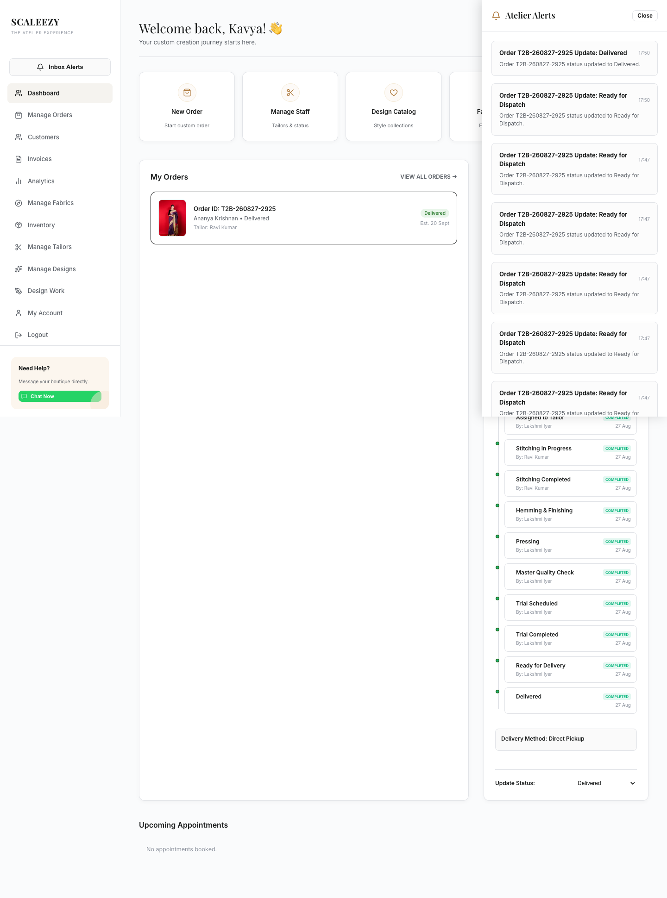

**Inbox Alerts** sits at the top of the sidebar with an unread badge. Each entry
carries a title, a time and a line of detail. Live alert types:

| Alert | Example |
|---|---|
| New order | *New Order Received: T2B-260827-2925 — A new custom order has been received for client Ananya Krishnan.* |
| Order status change | *Order T2B-260827-2925 Update: Confirmed — status updated to Confirmed.* |
| Inventory reorder | *Reorder level reached: Aari Beads — Ruby (EMB-BD-003) is down to 18.000 Piece, at or below its reorder level of 20.000.* |

The feed is per-user: staff see notifications addressed to them, the owner sees
the owner's feed. No one can post into another person's feed.

There is no email or push delivery of these — they are in-app only.

---


| Screen | Search | Filters | Notes |
|---|---|---|---|
| Manage Orders | Order ID or client | All / Active / Shipped / Delivered | |
| Customers | Name or mobile | All / Women / Men / Kids | |
| Invoices | Invoice ID or client | All / Paid / Pending | |
| Manage Designs (library) | — | Garment category tiles (15 + Uncategorised), designer, collection | |
| Inventory → Items | Item name | Category (8), **Reorder due only** | |
| Inventory → Catalogue | Full-text over the shipped catalogue | *Only what can be stocked* | |
| Inventory → Reports | — | From / To date range | |
| Design Work | — | **Only work still open** | Both owner and designer |
| Order wizard → existing customer | Name or mobile number | — | |
| Order wizard → fabrics | — | Boutique / Customer fabrics, then material | |

There are no user-controlled sort controls and no pagination controls anywhere
in the boutique workspace; lists render in the server's order.

---


**Figure 65 — Business Analytics & Trends**

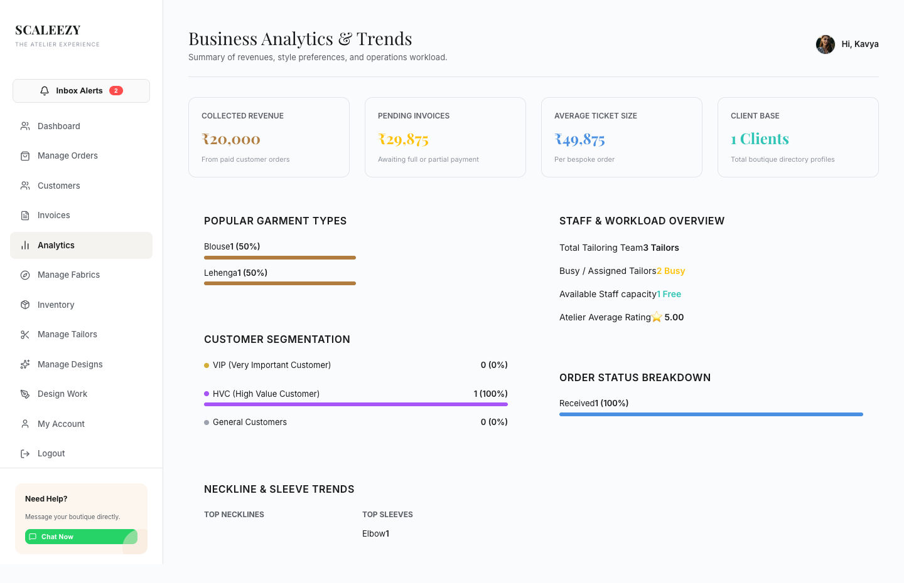

| Metric | What it means |
|---|---|
| **Collected Revenue** | Money actually recorded as paid |
| **Pending Invoices** | Outstanding balance across all orders |
| **Average Ticket Size** | Total invoiced ÷ number of orders |
| **Client Base** | Customer profiles in the directory |
| **Popular Garment Types** | Count and share, by garment across all orders |
| **Customer Segmentation** | VIP / HVC (High Value Customer) / General, by spend |
| **Neckline & Sleeve Trends** | Top necklines and sleeves ordered |
| **Staff & Workload** | Total tailors, busy, free, average rating |
| **Order Status Breakdown** | Orders by status |

Everything on this screen is computed in the browser from orders already
fetched. The one server-side reporting surface in the product is **Inventory →
Reports** ([§12](#12-inventory-management)), which does date ranges, stock
valuation, and waste/damage rates.

There is no export button on Analytics.

---


Everything is on **My Account** — see [§6.2](#62-boutique-setup--my-account).

| Setting | Who | Effect |
|---|---|---|
| Boutique Name / Address / Phone / Email | Owner | Printed on invoices and the customer tracking page |
| Boutique Logo | Owner | Branding |
| Require approval for new designs | Owner | Staff uploads wait for owner review |

Staff see the same screen with their own name, role and boutique, without the
editable boutique block.

There is **no password-change screen inside the workspace.** A staff member who
wants a new password uses *Forgot password?* on the sign-in page, which needs
working email; otherwise the owner reissues the account.

---


The workspace is genuinely responsive — it is not a separate app and not a
scaled-down desktop page. Captured at 390×844.

**Figure 66 — Sign in on a phone**

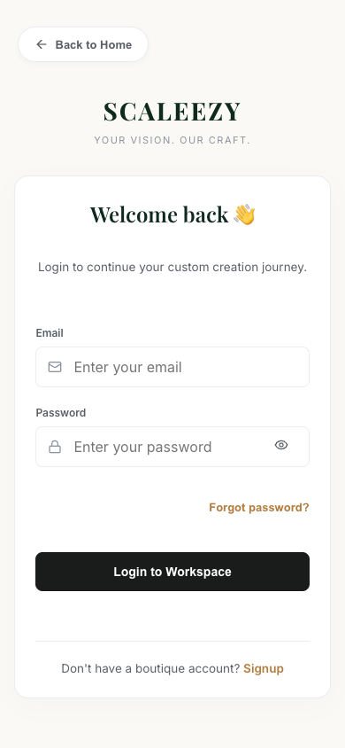

**Figure 67 — Owner dashboard**

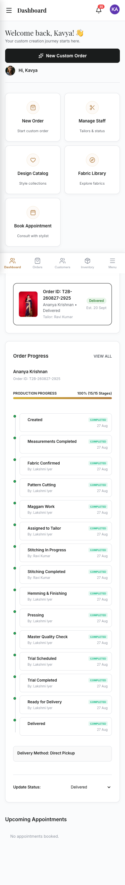

What changes on a phone:

1. The sidebar becomes a **bottom navigation bar** — for an owner: Dashboard,
   Orders, Customers, Inventory, Menu.
2. Everything else moves into the **Menu** sheet.
3. Tables become stacked cards.
4. The quick-action tiles become a two-column grid.
5. Order progress renders as a vertical timeline with COMPLETED chips and dates.

**Figure 68 — The Menu sheet**

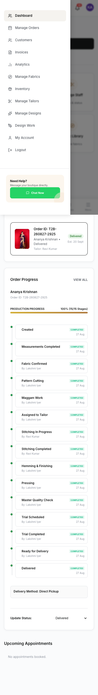

The bottom bar is role-aware: a Master gets Assignments, Orders, Customers,
Menu; a Tailor or designer gets Assignments, Account, Menu.

| Screen | Mobile screenshot |
|---|---|
| Orders | [m04](screenshots/mobile/m04-owner-orders.png) |
| Customers | [m05](screenshots/mobile/m05-owner-customers.png) |
| Inventory | [m06](screenshots/mobile/m06-owner-inventory.png) |
| Invoices | [m07](screenshots/mobile/m07-owner-invoices.png) |
| Tailor assignments | [m08](screenshots/mobile/m08-tailor-assignments.png) |
| Designer work | [m09](screenshots/mobile/m09-designer-work.png) |
| Customer tracking | [m10](screenshots/mobile/m10-customer-tracking.png) |

The customer tracking page is the one most often opened on a phone, and it is
built for it.

The order wizard works on a phone but is long; taking a first order at the
counter is more comfortable on a tablet or laptop.

---


A separate application at `/superadmin.html`, with its own bundle, its own
sign-in and its own API under `/api/superadmin/`. It is **not** reachable from a
boutique account.

**Figure 69 — Platform console sign-in**

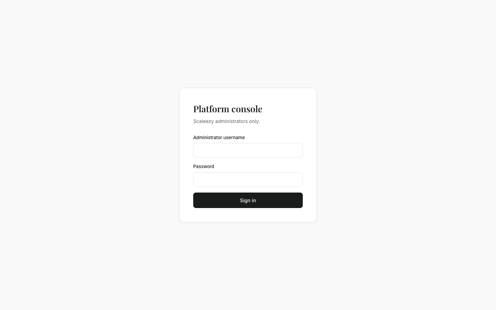

*Platform console — Scaleezy administrators only.* Administrator username and
password.

Access requires two things at once: the account must be a superuser **and** the
connection must be on the public registry schema. A superuser created inside a
boutique's own schema cannot get in.

> The screens below are documented from the shipped code, not from screenshots:
> capturing them needs platform-administrator credentials, which are not part of
> the boutique demo data. See the [coverage matrix](coverage-matrix.md).

| Group | Screen | What it does |
|---|---|---|
| Overview | **Dashboard** | Cross-boutique summary |
| | **System Health** | Platform health checks |
| Organizations | **Boutiques** | Every tenant; open one for detail; **suspend** / **reactivate**; toggle its modules |
| | **Users** | Cross-tenant user search and per-user actions |
| | **Onboarding** | How far each new boutique has got through setup |
| | **Leads** | Demo requests from the public site |
| Product | **Modules** | Which feature modules a boutique has switched on |
| | **Configuration** | Platform settings, including maintenance mode |
| Operations | **Orders Monitor** | Orders across all boutiques |
| | **Integrations** | Third-party connections |
| | **Customer Messaging** | Message activity |
| Reliability | **Error Center** | Unhandled exceptions, grouped by fingerprint, with a badge count |
| | Jobs & Queues | *Listed but marked absent — no data behind it* |
| | API Monitoring | *Listed but marked absent — no data behind it* |
| Security | **Audit Log** | Append-only record of console actions: actor, action, target, before/after, reason, IP |
| | **Sessions & Tokens** | Session and token management |
| Support | **Diagnostics** | Per-boutique support view |


Modules that can be switched off per boutique: Design Studio, Purchasing
Catalogue, Inventory, Garment Templates, Appointments, Production API, Activity
Feed, Fabrics, Team, Notifications, Public Order Tracking.

Always on and not switchable: authentication, boutique settings, the dashboard,
the public tracking page, the console itself — a console that can lock itself
out is not a console.

Deliberately absent from the module list, with the reason recorded in the code:
**Invoices** and **Reports** (computed in the browser, so a switch would hide a
menu item while `curl` walked straight past it) and **Try-On** (not implemented
at all). **Feature Flags** is likewise hidden: the model and API work but nothing
reads them, and a switch that controls nothing is worse than no switch.

---


**Figure 70 — Book an Appointment**


From the dashboard tile **Book Appointment**:

| Field | Values |
|---|---|
| Client * | From the customer directory |
| Type | Design Consultation / Measurement Fitting / Garment Trial / Final Delivery |
| Date & time * | |
| With | Unassigned, or any staff member |
| Notes | Free text |

**Book appointment** saves it, and it appears under **Upcoming Appointments** on
the dashboard with date, type, client and staff member.

**Figure 71 — Filled in**

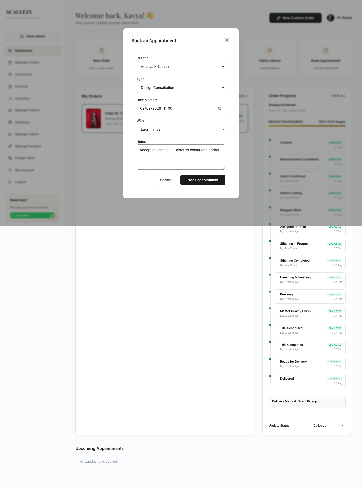

Appointments are not shown on the customer's tracking page and do not generate a
customer message.

---


Messages below are the product's own wording.

| Symptom | Message | What to do |
|---|---|---|
| Sign-in rejected | *Invalid login credentials. Please try again.* | Check the address is the one the login was issued to. Staff logins use the email typed into the tailor or designer record, lower-cased. |
| Signed out mid-work | *Your session has ended. Please sign in again.* | Sign in again; unsaved wizard progress is kept as a draft. |
| An action is refused | *You do not have permission to do that.* / *Your role does not permit this.* | The role does not own that action — see [§3](#3-roles-and-permissions). |
| Something vanished | *That no longer exists. It may have been removed.* | Another user deleted it; refresh the list. |
| Upload rejected | *That file is too large to upload.* | Photos are capped at 5 MB. |
| Server error | *The server could not complete that (error 500). Please try again.* | Retry; if it persists it lands in the Super Admin Error Center. |
| Two tabs on one draft | *This order was changed somewhere else.* | The draft was edited elsewhere. Reload before continuing. |
| **Next does nothing in the order wizard** | *(none — the button simply does not advance)* | A required field is unfilled. Most often **Trial Date** after setting Trial Required = Yes, or a garment's Type field. |
| Signup seems stuck | *Creating your boutique…* | Normal — schema creation takes 20–45 s. Do not reload. |
| Staff member cannot sign in | — | The one-time password was not copied. Reissue by editing the record, or use *Forgot password?*. |
| Password reset never arrives | — | Email is not configured (`EMAIL_HOST`). The request still reports success. |
| Try-On shows a broken image | — | Expected offline; the mock hot-links stock photos. See [§20](#20-try-on). |
| Empty screen with no error | e.g. *No items match these filters.* | A filter is still applied — clear it. |

---


**Can I take one order for a blouse and a lehenga together?** Yes. Pick both in
step 1; each gets its own measurements, design, materials and price.

**Where do I set my GST rate?** You cannot — it is fixed at 5%.

**A staff member lost their password.** It was shown once and is not
recoverable. Use *Forgot password?* if email is configured, or reissue the
account.

**Do customers get an automatic WhatsApp message?** No. The product writes the
message and hands it to WhatsApp; a person presses send.

**Can I delete a customer?** Not from the workspace.

**Why is my stock unchanged after taking an order?** Material is reserved when
*Fabric Confirmed* is completed and consumed at the stitching stages — not at
order creation.


**Why can I not advance the stitching stage?** Stitching belongs to the Tailor
role. You own stages 1–6 and 9–15.

**Can I edit a price?** No. Money is the owner's.

**Can I see every order?** Yes — Masters see the whole floor.


**Where are the measurements?** On your assignment card under *Measurements as
ordered*, and again inside every stage modal.

**How do I hand work back?** Complete *Stitching Completed*. The next stage is
already the Master's.

**Why can I only see some orders?** You see the orders you are assigned to.


**Why can I not see the customer's name?** By design — a designer account gets
the garment spec and the brief, not the client or the money.

**How do I submit work?** Upload in Design Studio, then pick it on My Work and
press *Submit design*.

**The owner asked for changes.** The item returns to your queue with their note.


**Do I need an account?** No. Your boutique sends you a link.

**Is my link private?** It is signed and works only for your order.

**When do photos appear?** Only after the boutique publishes them.

**Can I reply on the page?** No — call the number at the bottom, or reply on
WhatsApp.

---


| Term | Meaning in this product |
|---|---|
| **Boutique** | One business; one isolated database schema |
| **Tenant domain** | The schema name, shown on My Account |
| **Order** | One job for one customer, carrying one or more garments |
| **Order ID** | `T2B-YYMMDD-nnnn`; also the invoice number |
| **Garment** | One item being stitched, with its own template |
| **Garment template** | The field set for a garment type — what a Blouse asks that a Lehenga does not |
| **Design** | A catalogue or uploaded reference in the design library |
| **Design work** | A garment handed to a designer, with a brief and a due date |
| **Board** | The per-garment shortlist of designs in the order wizard |
| **Measurement version** | A dated snapshot of a customer's measurements |
| **Master** | Supervising tailor; cutting and quality |
| **Tailor** | Stitching tailor |
| **Specialist** | Measurement / Pattern / Cutting / Maggam / Finishing / Pressing / QC Master |
| **Production stage** | One of the 15 shop-floor steps |
| **Order status** | One of the 8 commercial states |
| **SLA** | The target hours for a stage |
| **Maggam work** | Aari / zardosi embroidery, done on cut fabric before stitching |
| **Fall & pico** | Saree edge finishing |
| **Stock movement** | A ledger row: stock-in, reserve, release, issue, consume, waste, return, adjust |
| **Recipe** | A garment's bill of materials |
| **Reorder level** | The quantity that triggers a reorder alert |
| **Dead stock** | No movement in 90 days |
| **HVC / VIP** | Customer value segments |
| **Style DNA / Style Profile** | Derived preferences on the customer profile |
| **Tracking link** | The signed `/track/<token>/` URL |
| **Module** | A feature area the platform can switch off per boutique |

---


Everything here was observed in the running build on 27 Aug 2026, not inferred
from a specification. Each entry names how it was checked.


| | |
|---|---|
| **Expected** | Drape the chosen fabric on the chosen design and show the customer |
| **Actual** | A modal picks a stock Unsplash photograph by fabric colour keyword after a two-second fake delay. The customer's design, measurements and fabric are not used. With no internet the panel shows a broken image. |
| **Impact** | Cannot be demonstrated as a real capability. Customers never see it — it is staff-side only. |
| **Verified by** | Running it (Figures 62–63) and reading `getDrapedPreviewImage`; the module registry records `try_on: 'Not implemented anywhere in this product.'` |
| **Next** | Either integrate a real garment-visualisation service, or relabel the button as a fabric/style reference board |


| | |
|---|---|
| **Expected** | The card logos on the checkout imply a card can be charged |
| **Actual** | Nothing is charged anywhere. Payment is *recorded* — the boutique collects by its own means. |
| **Impact** | Do not promise online collection in a demo |
| **Verified by** | Completing checkout and settling the balance; no gateway exists in the codebase |
| **Next** | Integrate a payment provider, or remove the card-network logos |


| | |
|---|---|
| **Expected** | A design saved as a Lehenga appears under Lehenga in the library |
| **Actual** | The library groups by garment **template**, and *Add New Design* sets only a garment-type string. All three catalogue designs saved that way show under **Uncategorised**; the design uploaded through the Design Studio (which sets the template) categorised correctly. |
| **Impact** | The library looks empty per garment while holding designs |
| **Verified by** | Three designs saved with types Lehenga / Lehenga / Saree; library reads *Uncategorised 3* |
| **Next** | Make *Add New Design* set the garment template, or group the library by garment type as a fallback |


| | |
|---|---|
| **Expected** | The same garment list everywhere |
| **Actual** | The modal offers Lehenga, Gown, Saree, Kurti, Sherwani, Anarkali. **There is no Blouse** — the single most-ordered garment in this market — nor Lehenga Blouse, Dupatta, Petticoat, Salwar, Churidar, Palazzo, Sharara, Suit (Kameez). |
| **Impact** | Catalogue designs for most garments cannot be typed correctly |
| **Verified by** | Reading the modal's options; the order wizard and Design Studio both offer fifteen |
| **Next** | Drive this select from the garment-template list |


| | |
|---|---|
| **Expected** | A QC Master added to the team appears on the team screen |
| **Actual** | The screen renders two rosters only — Master Tailors and Stitching Tailors. A QC Master (or Cutting, Pattern, Maggam, Finishing, Pressing, Measurement Master) is created, gets a login, receives their stages and can sign in — but appears in neither list. |
| **Impact** | The owner cannot see, edit or reshare credentials for a specialist |
| **Verified by** | Creating *Sunita Rao — QC Master*: absent from the screen, present in the appointment staff picker and able to sign in |
| **Next** | Render a third roster, or group by role |


| | |
|---|---|
| **Expected** | On a two-garment order, the blouse can be stitched while the lehenga is still being cut |
| **Actual** | One set of 15 stages covers the whole order. Everything else — measurements, design, materials, price, design work — is per garment. |
| **Impact** | Staged progress on a multi-garment order is approximate |
| **Verified by** | The demo order carries two garments and one stage ladder |
| **Next** | Per-garment stage ladders, with the order rolling up |


| | |
|---|---|
| **Expected** | Each field on the page has its own id, so its label points at it |
| **Actual** | Fields are keyed `tf-<field>` per garment template, so two garments on one order repeat them. **17 duplicated ids** on a Blouse + Lehenga order — `tf-occasion`, `tf-waist`, `tf-delivery_date`, `tf-main_fabric` and more. Clicking the second garment's label, or reaching it with a screen reader, targets the first garment's field. |
| **Impact** | Accessibility defect on the most important screen in the product; also breaks automated testing by label |
| **Verified by** | Counting duplicate ids in the live DOM on the garment step |
| **Next** | Prefix ids with the garment key |


| | |
|---|---|
| **Actual** | GST is fixed at **5%**; packaging defaults to **₹500**; base prices per garment type are a constant in the frontend (Lehenga ₹32,000, Sherwani ₹35,000, Gown ₹25,000, Suit ₹22,000, Anarkali ₹18,000, Saree ₹15,000, Kurti ₹5,000, everything else ₹15,000) |
| **Impact** | A boutique on a different rate, or with its own price list, must retype every price on every order |
| **Verified by** | Reading `GARMENT_PRICES` and the quote calculation; confirmed on the demo order |
| **Next** | Move rates and price lists into boutique settings |


| | |
|---|---|
| **Actual** | Messages are composed and queued; **Open WhatsApp** hands them to WhatsApp for a human to send, and **Mark sent** clears the queue. No message leaves the system on its own. |
| **Impact** | Real, but not automation — say so plainly in a demo |
| **Verified by** | Sending the demo order's five queued updates |
| **Next** | WhatsApp Business API integration |


| | |
|---|---|
| **Expected** | The invoice reflects where the fabric came from — the order records it per garment as *Customer Provided Fabric*, *Store Inventory Fabric* or *Mixed* |
| **Actual** | The invoice decides from the **fabric price** instead: a garment with no fabric price typed into the step-6 breakdown is printed as *Customer supplied fabric*, and the invoice header reads *Fabric: Customer Fabric*. |
| **Impact** | Customer-facing and billing-relevant. On the demo order both garments were made from the boutique's own Kanchipuram Silk — 5.7 m consumed from stock, recorded in the ledger — and the invoice still reads *Customer supplied fabric* on both lines, because the fabric component of the price was left at zero. |
| **Verified by** | Figure 57, against the order's own *Material Source: Store Inventory Fabric* and the stock ledger |
| **Next** | Read the garment's material source, not its price, and fall back to the price only for the amount |

**Working around it today:** type the fabric cost into each garment's **Fabric**
field in the step-6 cost breakdown. The line then reads *Includes boutique
fabric — ₹x*.


| Gap | Detail | Verified by |
|---|---|---|
| Pinterest / Google Images | Listed as design sources in the AI Design Studio, both read *not connected* | Wizard step 3 |
| No password change in-app | Only *Forgot password?*, which needs SMTP; with no mail backend the request still reports success | Every account screen |
| No customer delete | Customers can be created and edited, not removed | Customers screen |
| No export | Analytics has no download; only Inventory → Reports is server-side | Analytics screen |
| No sorting or pagination controls | Lists render in server order | Every list screen |
| Production API module | Registered as a module, described as *Production tasks and QC records. No screen calls this yet.* | Module registry |
| Feature Flags console screen | Model, API and tests exist; nothing reads them, so the screen is deliberately hidden | Console navigation source |
| Jobs & Queues, API Monitoring | Listed in the console and marked *absent* — the screens explain what is missing rather than showing empty charts | Console navigation source |
| Invoices / Reports not gateable | Computed in the browser, so a module switch would hide a menu item without protecting anything — deliberately excluded from the module list | Module registry |
| Owner-by-absence role fallback | An account left with no staff profile resolves to Owner. Both routes to that state are closed at their call sites, and the code marks it a known weakness. | `core/roles.py` |

---


```text
                        PUBLIC WEBSITE
                   (pitch · demo request → Leads)
                               │
                          SIGN UP
                   own schema · own data · own staff
                               │
                    ┌──────────┴──────────┐
                    │   BOUTIQUE OWNER    │
                    └──────────┬──────────┘
        ┌──────────┬───────────┼───────────┬──────────┐
        │          │           │           │          │
   CUSTOMERS   DESIGNS      TEAM      INVENTORY   FABRICS
        │          │           │           │          │
        │      DESIGNER   MASTER  TAILOR   │          │
        │          │        │       │      │          │
        └──────────┴────────┴───┬───┴──────┴──────────┘
                                │
                            ORDER  (1..n garments)
                                │
          ┌─────────────┬───────┼────────┬──────────────┐
    MEASUREMENTS    DESIGN   FABRIC  MATERIALS       PRICE
     (versioned)   (board)          (reserved)   (+GST 5%)
          └─────────────┴───────┬────────┴──────────────┘
                                │
                    PRODUCTION — 15 stages
       Owner/Master 1–6 · Tailor 7–8 · Master/specialists 9–15
                                │
                     material consumed at stitching
                                │
                  QC · TRIAL · READY FOR DELIVERY
                                │
        ┌───────────────────────┼───────────────────────┐
   PHOTOS PUBLISHED       PAYMENT SETTLED           INVOICE
        └───────────────────────┼───────────────────────┘
                                │
                           DELIVERED
                                │
                    CUSTOMER TRACKING LINK
              (status · 15 stages · photos · payment
                    · collection — no sign-in)

                    ────────────────────────
                      SUPER ADMIN CONSOLE
        boutiques · suspension · module gating · users
        onboarding · leads · orders monitor · errors
        audit log · sessions · diagnostics · health
                    ────────────────────────
```

---


Every image in `screenshots/`, including those not embedded above.


Useful when demonstrating onboarding, and when writing training material.

| Screen | Empty | With data |
|---|---|---|
| Dashboard | [empty](screenshots/owner/10-owner-dashboard-empty.png) | [with data](screenshots/owner/10-owner-dashboard.png) |
| Manage Orders | [empty](screenshots/owner/11-owner-orders-empty.png) | [with data](screenshots/owner/11-owner-orders.png) |
| Customers | [empty](screenshots/owner/12-owner-customers-empty.png) | [with data](screenshots/owner/12-owner-customers.png) |
| Invoices | [empty](screenshots/owner/13-owner-invoices-empty.png) | [with data](screenshots/owner/13-owner-invoices.png) |
| Analytics | [empty](screenshots/owner/14-owner-analytics-empty.png) | [with data](screenshots/owner/14-owner-analytics.png) |
| Manage Fabrics | [empty](screenshots/owner/15-owner-fabrics-empty.png) | [with data](screenshots/owner/15-owner-fabrics.png) |
| Inventory | [empty](screenshots/owner/16-owner-inventory-empty.png) | [with data](screenshots/owner/16-owner-inventory.png) |
| Manage Tailors | [empty](screenshots/owner/17-owner-tailors-empty.png) | [with data](screenshots/owner/17-owner-tailors.png) |
| Manage Designs | [empty](screenshots/owner/18-owner-designs-empty.png) | [with data](screenshots/owner/18-owner-designs.png) |
| Design Work | [empty](screenshots/owner/19-owner-design-work-empty.png) | [with data](screenshots/owner/19-owner-design-work.png) |
| My Account | [empty](screenshots/owner/20-owner-account-empty.png) | [with data](screenshots/owner/20-owner-account.png) |

The empty states are written, not blank: *No active custom orders. Click "New
Custom Order" to begin!* · *Add your first customer* · *Create your first order*
· *No Master Tailors registered yet.* · *No design work outstanding. Assign a
garment above to get started.* · *No items match these filters.*


| Screenshot | What it shows |
|---|---|
| [Signup form filled](screenshots/common/03b-signup-step1-filled.png) | Step 1 completed, before Create Account |
| [Add New Tailor, blank](screenshots/owner/17b-owner-add-tailor.png) | The empty staff form |
| [Fabric visualizer banner](screenshots/owner/47-order-fabric-visualizer.png) | *Scaleezy Live Visualizer Available*, before the modal |
| [Order delivered](screenshots/owner/11e-owner-order-delivered.png) | The order card at Delivered |
| [Master Quality Check](screenshots/master/58-master-quality-check.png) | The QC stage modal |
| [Ready for Delivery](screenshots/master/59-master-ready-for-delivery.png) | The floor with production complete |
| [QC Master account](screenshots/master/56-qc-my-account.png) | A specialist's My Account |
| [Tailor account](screenshots/tailor/71-tailor-my-account.png) | A tailor's My Account |
| [Designer studio](screenshots/designer/81-designer-design-studio.png) | The designer's Design Studio landing |
| [Designer account](screenshots/designer/82-designer-my-account.png) | A designer's My Account |
